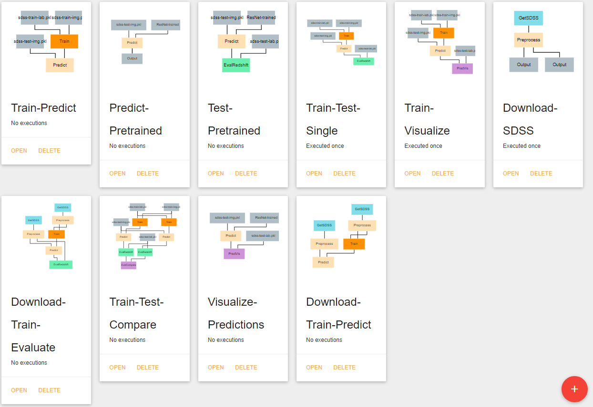
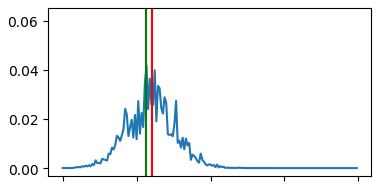

Redshift Estimation
===================

The project described on this page can be found in the `examples repo <https://github.com/deepforge-dev/examples/tree/master/redshift-tutorial>`_ on GitHub under the name **Redshift-Application.webgmex**

This project provides a small collection of generalized pipelines for the training and utilization of redshift estimation models. This project is designed to allow simple use by only requiring that the configuration parameters of individual nodes be defined where necessary. The most involved alterations that should be necessary for most users is the definition of additional architectures in the **Resources** tab. It should be noted that any newly defined architecture should have an output length and input shape that match the *num_bins* and *input_shape* configuration parameters being used in the various pipelines.

Pipeline Overview
-----------------

* `Train Test Single`_
* `Train Test Compare`_
* `Download Train Evaluate`_
* `Train Predict`_
* `Predict Pretrained`_
* `Test Pretrained`_
* `Download SDSS`_
* `Download Train Predict`_
* `Visualize Predictions`_

Pipelines
---------

Train Test Single
~~~~~~~~~~~~~~~~~
Trains and evaluates a single CNN model.  Uses predefined artifacts that contain the training and testing data. For this and all training pipelines, the artifacts should each contain a single numpy array. Input arrays should be a 4D array of shape **(n, y, x, c)** where n=number of images, y=image height, x=image width, and c=number of color channels. Output (label) arrays should be of shape **(n,)** .

Train Test Compare
~~~~~~~~~~~~~~~~~~
Trains and evaluates two CNN models and compares effectiveness of the models.

Download Train Evaluate
~~~~~~~~~~~~~~~~~~~~~~~
Downloads SDSS images, trains a model on the images, and evaluates the model on a separate set of downloaded images.  Care should be taken when defining your own CasJobs query to ensure that all queried galaxies for training have a redshift value below the **Train** node’s *max_val* configuration parameter’s value.

Train Predict
~~~~~~~~~~~~~
Trains a single CNN model and uses the newly trained model to predict the redshift value of another set of galaxies.

Predict Pretrained
~~~~~~~~~~~~~~~~~~
Predicts the redshift value of a set of galaxies using a pre-existing model that is saved as an artifact.

Test Pretrained
~~~~~~~~~~~~~~~
Evaluates the performance of a pre-existing model that is saved as an artifact.

Download SDSS
~~~~~~~~~~~~~
Download SDSS images and save them as artifacts. Can be used in conjunction with the other pipelines that rely on artifacts rather than images retrieved at execution time.

Download Train Predict
~~~~~~~~~~~~~~~~~~~~~~
Download SDSS images and use some images to train a model before using the model to predict the redshift value of the remaining galaxies.

Visualize Predictions
~~~~~~~~~~~~~~~~~~~~~
This pipeline produces a visualization that can be helpful for understanding the effectiveness of your redshift estimation model. It generates a set of graphs like the one below that show the output probability distribution function (pdf) for the redshift values of a set of random galaxies' images. A pair of vertical  lines in each subplot indicate the actual redshift value (green) and the predicted redshift value (red) for that galaxy. This allows users to see how far the model's predictions are from the correct answers and can help with identifying biases or weak-points the model may have (for example, consistently underestimation or inaccuracy with galaxies in a specific redshift range).

