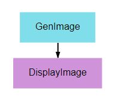
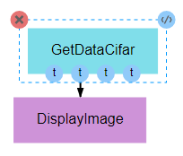
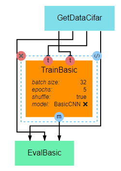
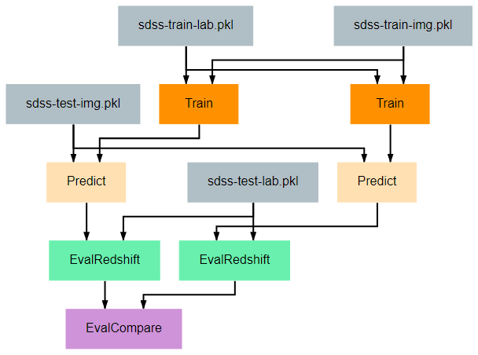
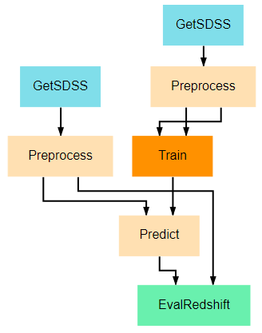

Tutorial Project - Redshift
===========================
The project described on this page can be found in the `examples repo <https://github.com/deepforge-dev/examples/tree/master/redshift-tutorial>`_ on GitHub under the name **Redshift-Tutorial.webgmex**

Pipeline Overview
-----------------
1. `Basic Input/Output`_
2. `Display Random Image`_
3. `Display Random CIFAR-10`_
4. `Train CIFAR-10`_
5. `Train-Test`_
6. `Train-Test-Compare`_
7. `Download-Train-Evaluate`_

.. 6. `Visualize Predictions`_

Pipelines
---------

Basic Input/Output
~~~~~~~~~~~~~~~~~~
This pipeline provides one of the simplest examples of a pipeline possible in DeepForge. Its sole purpose is to create an array of numbers, pass the array from the first node to the second node, and print the array to the output console.

The **Output** operation shown is a special built-in operation that will save the data that is provided to it to the selected storage backend. This data will then be available within the same project as an artifact and can be accessed by other pipelines using the special built-in **Input** operation.

.. figure:: basic-io.png
    :align: center

.. code-block:: python

    import numpy

    class GenArray():
        def __init__(self, length=10):
            self.length = length
            return

        def execute(self):
            arr = list(numpy.random.rand(self.length))
            return arr

Display Random Image
~~~~~~~~~~~~~~~~~~~~

This pipeline’s primary purpose is to show how graphics can be output and viewed. A random noise image is generated and displayed using matplotlib’s pyplot library.  Any graphic displayed using the **plt.show()** function can be viewed in the executions tab.

.. code-block:: python

    from matplotlib import pyplot as plt
    from random import randint

    class DisplayImage():
        def execute(self, image):
            if len(image.shape) == 4:
                image = image[randint(0, image.shape[0] - 1)]
            plt.imshow(image)
            plt.show()

Display Random CIFAR-10
~~~~~~~~~~~~~~~~~~~~~~~

As  with  the  previous  pipeline,  this  pipeline  simply  displays  a  single  image.   The  image  from  this pipeline, however, is more meaningful, as it is drawn from the commonly used `CIFAR-10 dataset <http://www.cs.toronto.edu/~kriz/cifar.html>`_. This pipeline seeks to provide an example of the input being used in the next pipeline while providing an example of how the data can be obtained. This is important for users who seek to develop their own pipelines, as CIFAR-10 data generally serves as an effective baseline for testing and development of new CNN architectures or training processes.

Also note, as shown in the figure above, that it is not necessary to utilize all of the outputs of a given node. Unless specifically handled, however, it is generally inappropriate for an input to be left undefined.

.. code-block:: python

    from keras.datasets import cifar10

    class GetDataCifar():
        def execute(self):
            ((train_imgs, train_labels),
            (test_imgs, test_labels)) = cifar10.load_data()
            return train_imgs, train_labels, test_imgs, test_labels

Train CIFAR-10
~~~~~~~~~~~~~~

This pipeline gives a very basic example of how to create, train, and evaluate a simple CNN. The primary takeaway from this pipeline should be the overall structure of a training pipeline, which should follow the following steps in most cases:

1. Load data
2. Define the loss, optimizer, and other metrics
3. Compile model, with loss, metrics, and optimizer, using the **compile()** method
4. Train model using the **fit()** method, which requires the training inputs and outputs
5. Output the trained model for serialization and/or utilization in subsequent nodes

.. code-block:: python

    import numpy as np
    import keras

    class TrainBasic():
        def __init__(self, model, epochs=20, batch_size=32, shuffle=True):
            self.model = model
            self.epochs = epochs
            self.batch_size = batch_size
            self.shuffle = shuffle
            return

        def execute(self, train_imgs, train_labels):
            opt = keras.optimizers.rmsprop(lr=0.001)
            self.model.compile(loss='sparse_categorical_crossentropy',
                            optimizer=opt,
                            metrics=['sparse_categorical_accuracy'])
            self.model.fit(train_imgs,
                        train_labels,
                        batch_size=self.batch_size,
                        epochs=self.epochs,
                        shuffle=self.shuffle,
                        verbose=2)
            model = self.model
            return model

.. code-block:: python

    class EvalBasic():
        def __init__(self):
            return

        def execute(self, model, test_imgs, test_labels):
            results = model.evaluate(test_imgs, test_labels, verbose=0)
            for i, metric in enumerate(model.metrics_names):
                print(metric,'-',results[i])
            return results

Train-Test
~~~~~~~~~~

This pipeline provides an example of how one might train and evaluate a redshift estimation model. In particular, the procedure implemented here is a simplified version of work by `Pasquet et. al. (2018) <https://www.aanda.org/articles/aa/abs/2019/01/aa33617-18/aa33617-18.html>`_. For readers unfamiliar with cosmological redshift, `this article <https://earthsky.org/astronomy-essentials/what-is-a-redshift>`_ provides a simple and brief introduction to the topic. For the training process, there are two primary additions that should be noted.

First, the **Train** class has been given a function named **to_categorical**. In line with the Paquet et. al. method linked above, this tutorial uses a classification model rather than a regression model for estimation. Because we are using classification models, the keras model expects the output labels to be either one-hot vectors or a single integer where the position/value indicates the range in which the true redshift value falls. This function converts the continuous redshift values into the necessary discrete, categorical format.

Second, a class has been provided to give examples of how researchers may define their own `keras Sequence <https://keras.io/api/utils/python_utils/#sequence-class>`_ for training. Sequences are helpful in that they allow alterations to be made to the data during training. In the example given here, the **SdssSequence** class provides the ability to rotate or flip images before every epoch, which will hopefully improve the robustness of the final model.

The evaluation node has also been updated to provide metrics more in line with redshift estimation. Specifically, it calculates the fraction of outlier predictions, the model’s prediction bias, the deviation in the MAD scores of the model output, and the average Continuous Ranked Probability Score (CRPS) of the output.

.. Visualize Predictions
.. ~~~~~~~~~~~~~~~~~~~~~

Train-Test-Compare
~~~~~~~~~~~~~~~~~~

This pipeline gives a more complicated example of how to create visualizations that may be helpful for understanding the effectiveness of a model. The **EvalCompare** node provides a simple comparison visualization of two models.

Download-Train-Evaluate
~~~~~~~~~~~~~~~~~~~~~~~

This pipeline provides an example of how data can be retrieved and utilized in the same pipeline. The previous pipelines use manually uploaded artifacts.  In many real cases, users may desire to retrieve novel data or more specific data using SciServer’s CasJobs API. In such cases, the **DownloadSDSS** node here makes downloading data relatively simple for users. It should be noted that the data downloaded is not in a form easily usable by our models and first requires moderate preprocessing, which is performed in the **Preprocessing** node. This general structure of download-process-train is a common pattern, as data is rarely supplied in a clean, immediately usable format.
