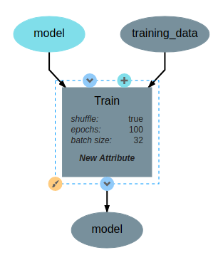
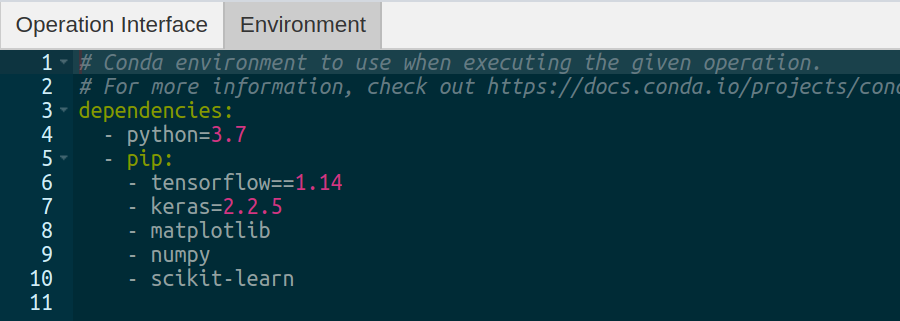
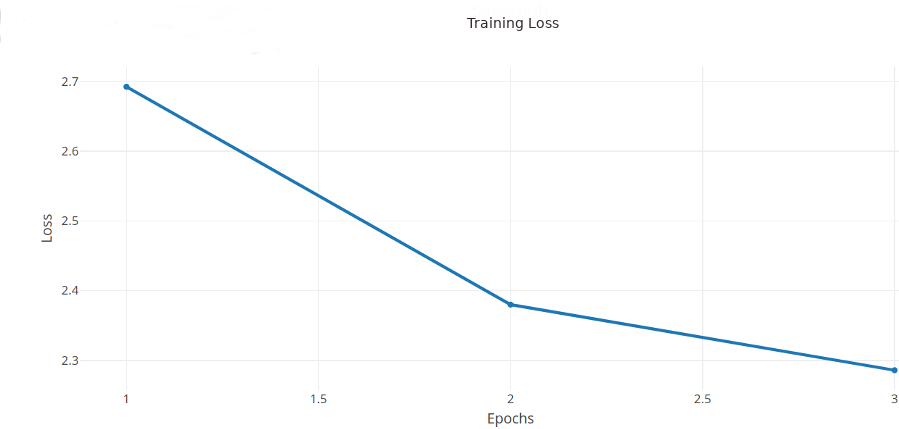

Custom Operations
=================

In this document we will outline the basics of custom operations including the operation editor and operation feedback utilities.

The Basics
----------
Operations are used in pipelines and have named inputs and outputs. When creating a pipeline, if you don't currently find an operation for the given task, you can easily create your own by selecting the `New Operation...` operation from the add operation dialog. This will create a new operation definition and open it in the operation editor. The operation editor has two main parts, the interface editor and the implementation editor.

.. figure:: operation_editor.png
    :align: center

    Editing the "TrainValidate" operation from the "redshift" example

The interface editor is provided on the right and presents the interface as a diagram showing the input data and output data as objects flowing into or out of the given operation. Selecting the operation node in the operation interface editor will expand the node and allow the user to add or edit attributes for the given operation. These attributes are exposed when using this operation in a pipeline and can be set at design time - that is, these are set when creating the given pipeline. The interface diagram may also contain light blue nodes flowing into the operation. These nodes represent "references" that the operation accepts as input before running. When using the operation, references will appear alongside the attributes but will allow the user to select from a list of all possible targets when clicked.

    The TrainValidate operation accepts training data, a model and attributes for setting the batch size, and the number of epochs.

The operation editor also provides an interface to specify operation python dependencies. DeepForge uses
:code:`conda` to manage python dependencies for an operation. This pairs well with the integration of various compute platforms that available to the user and the only requirement for a user is to have Conda installed in their computing platform. You can specify operation dependencies using a conda environment `file <https://docs.conda.io/projects/conda/en/latest/user-guide/tasks/manage-environments.html#create-env-file-manually>`_ as shown in the diagram below:

    The operation environment contains python dependencies for the given operation.

To the left of the operation editor is the implementation editor. The implementation editor is a code editor specially tailored for programming the implementations of operations in DeepForge. It also is synchronized with the interface editor. A section of the implementation is shown below:

.. code:: python

    import numpy as np
    from sklearn.model_selection import train_test_split
    import keras
    import time
    from matplotlib import pyplot as plt

    import tensorflow as tf

    import tensorflow as tf
    config = tf.compat.v1.ConfigProto()
    config.gpu_options.allow_growth = True
    sess = tf.compat.v1.Session(config=config)

    class TrainValidate():
        def __init__(self, model, epochs=10, batch_size=32):
            self.model=model
            self.batch_size = batch_size
            self.epochs = epochs
            np.random.seed(32)
            return

        def execute(self, dataset):
            model=self.model
            model.summary()
            model.compile(optimizer='adam',
                          loss='sparse_categorical_crossentropy',
                          metrics=['sparse_categorical_accuracy'])
            X = dataset['X']
            y = dataset['y']
            y_cats = self.to_categorical(y)
            model.fit(X, y_cats,
                      epochs=self.epochs,
                      batch_size=self.batch_size,
                      validation_split=0.15,
                      callbacks=[PlotLosses()])
            return model.get_weights()

        def to_categorical(self, y, max_y=0.4, num_possible_classes=32):
            one_step = max_y / num_possible_classes
            y_cats = []
            for values in y:
                y_cats.append(int(values[0] / one_step))
            return y_cats

        def datagen(self, X, y):
            # Generates a batch of data
            X1, y1 = list(), list()
            n = 0
            while 1:stash@{1}
                for sample, label in zip(X, y):
                    n += 1
                    X1.append(sample)
                    y1.append(label)
                    if n == self.batch_size:
                        yield [[np.array(X1)], y1]
                        n = 0
                        X1, y1 = list(), list()

    class PlotLosses(keras.callbacks.Callback):
        def on_train_begin(self, logs={}):
            self.i = 0
            self.x = []
            self.losses = []

        def on_epoch_end(self, epoch, logs={}):
            self.x.append(self.i)
            self.losses.append(logs.get('loss'))
            self.i += 1

            self.update()

        def update(self):
            plt.clf()
            plt.title("Training Loss")
            plt.ylabel("CrossEntropy Loss")
            plt.xlabel("Epochs")
            plt.plot(self.x, self.losses, label="loss")
            plt.legend()
            plt.show()

The "TrainValidate" operation uses capabilities from the :code:`keras` package to train the neural network. This operation sets all the parameters using values provided to the operation as either attributes or references. In the implementation, attributes are provided as arguments to the constructor making the user defined attributes accessible from within the implementation. References are treated similarly to operation inputs and are also arguments to the constructor. This can be seen with the :code:`model` constructor argument. Finally, operations return their outputs in the :code:`execute` method; in this example, it returns a single output named :code:`model`, that is, the trained neural network.

After defining the interface and implementation, we can now use the "TrainValidate" operation in our pipelines! An example is shown below.

.. figure:: train_operation.png
    :align: center
    :scale: 85 %

    Using the "TrainValidate" operation in a pipeline

Operation Feedback
------------------
Operations in DeepForge can generate metadata about its execution. This metadata is generated during the execution and provided back to the user in real-time. An example of this includes providing real-time plotting feedback. When implementing an operation in DeepForge, this metadata can be created using the :code:`matplotlib` plotting capabilities.

    An example graph of the loss function while training a neural network.
