Interface Overview
==================
The DeepForge editor interface is separated into six views for defining all of the necessary features of your desired project. The details of each interface tab are detailed below. You can switch to any of the views at any time by clicking the appropriate icon on the left side of the screen. In order, the tabs are:

+---------------+--------------------------+
| |tabs|        | - Pipelines_             |
|               | - Executions_            |
|               | - Resources_             |
|               | - Artifacts_             |
|               | - `Custom Utils`_        |
|               | - `Custom Serialization`_|
+---------------+--------------------------+

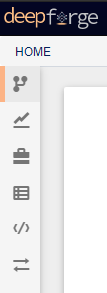

Pipelines
---------
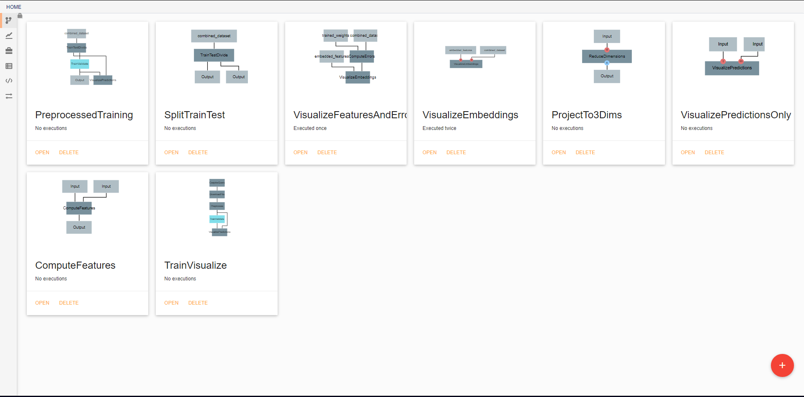

In the initial view, all pipelines that currently exist in the project are displayed. New pipelines can be created using the floating red button in the bottom right. From this screen, existing pipelines can also be opened for editing, deleted, or renamed.

Pipeline editing
~~~~~~~~~~~~~~~~
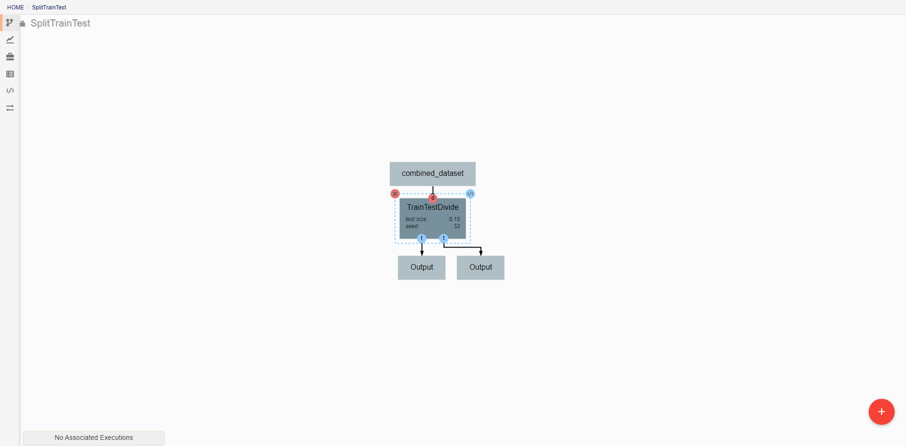

DeepForge pipelines are directed acyclic graphs of operations, where each operation is an isolated python module. Operations are added to a pipeline using the red plus button in the bottom right of the workspace. Any operations that have previously been defined in the project can be added to the pipeline, or new operations can be created when needed. Arrows in the workspace indicate the passing of data between operations. These arrows can be created by clicking on the desired output (bottom circles) of the first operation before clicking on the desired input (top circles) of the second operation. Clicking on a operation also gives the options to delete (red X), edit (blue </>), or change attributes. Information on the editing of operations can be found in `Custom Operations <custom_operations.rst>`_

Pipelines are executed by clicking the yellow play button in the bottom right of the workspace. In the window that appears, you can name the execution, select a computation platform, and select a storage platform. Computation platforms specify what the compute resources used for execution of the operations, such as `SciServer Compute <https://apps.sciserver.org/compute/>`_, will be. Supported storage platforms, such as endpoints with an S3-compatible API, are used to store intermediate and output data. The provided storage option will be used for storing both the output objects defined in the pipeline, as well as all files used in execution of the pipeline.

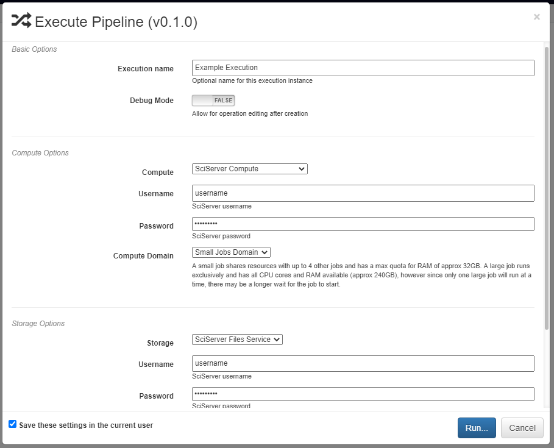

Executions
----------
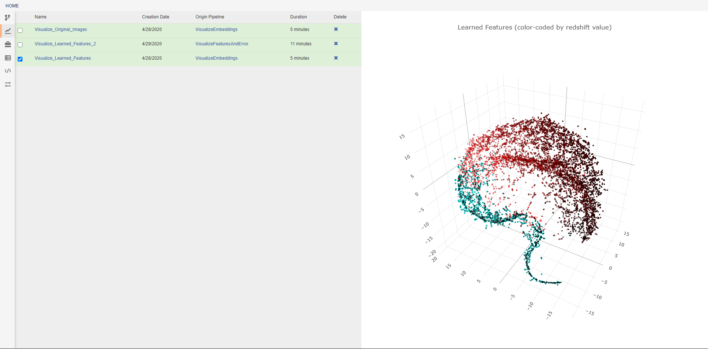

This view allows the review of previous pipeline executions. Clicking on any execution will display any plotted data generated by the pipeline, and selecting multiple executions will display all of the selected plots together. Clicking the provided links will open either the associated pipeline or a trace of the execution (shown below). The blue icon in the top right of every operation allows viewing the text output of that operation. The execution trace can be viewed during execution to check the status of a running job. During execution, the color of a operation indicates its current status. The possible statuses are:

- **Dark gray**: Pending Execution
- **Light gray**: Execution Queued
- **Yellow**: Execution in Progress
- **Orange**: Execution Cancelled
- **Green**: Successfully Finished Execution
- **Red**: Execution Failed

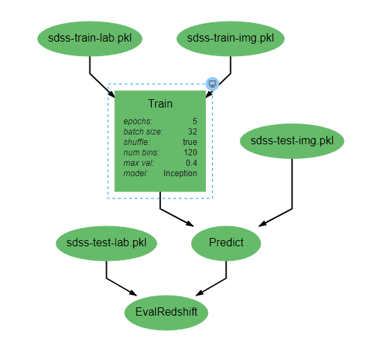

Resources
---------
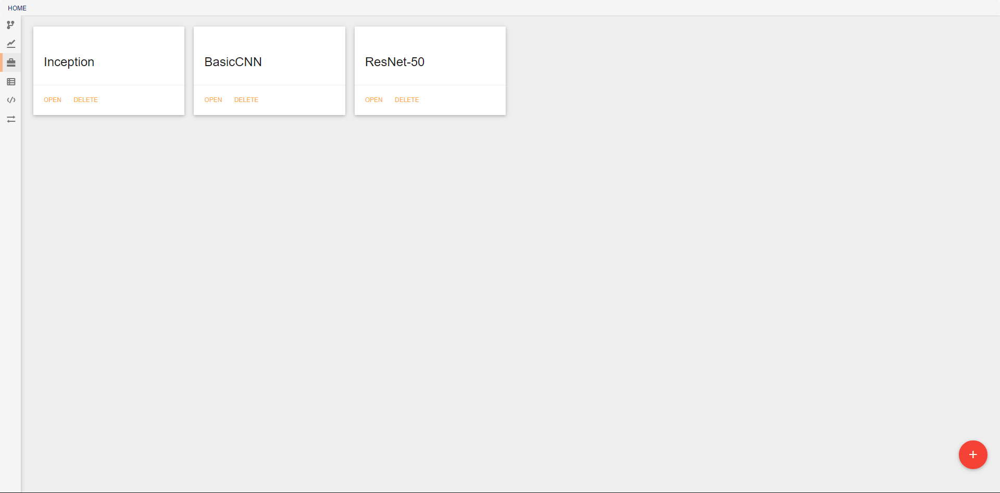

This view shows the resources available for use in pipelines. Different types of resources are made available through DeepForge extensions and enable the introduction of new concepts into the project. One such example is `deepforge-keras <https://github.com/deepforge-dev/deepforge-keras>`_ which enables users to make neural networks architectures with a custom visual editor. The created architectures can then be referenced and used by operations for tasks such as training. From this view, resources can be created, deleted, and renamed.

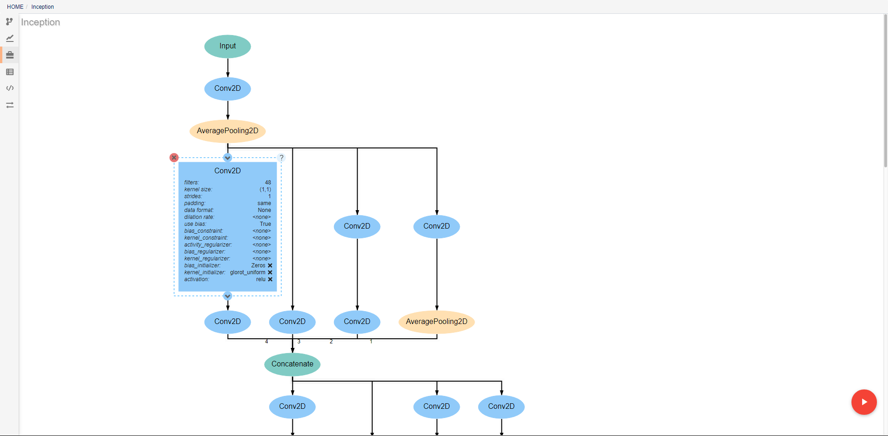

As with pipelines, the neural networks are depicted as directed graphs. Each node in the graph corresponds to a single layer or operation in the network (information on operations can be found on the `keras website <https://keras.io/api/>`_). Clicking on a layer provides the ability to change the attributes of that layer, delete the layer, or add new layers before or after the current layer. Many operations require that certain attributes be defined before use. The Conv2D operation pictured above, for example, requires that the *filters* and *kernel_size* attributes be defined. If these are left as *<none>*, a visual indicator will show that there is an error to help prevent mistakes. In order to ease analysis and development, hovering over any connecting line will display the shape of the data as it moves between the given layers.

Artifacts
---------
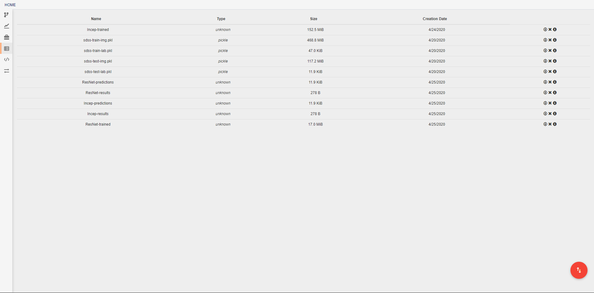

In this view, you can see all artifacts that are available to your pipelines. These artifacts can be used in any pipeline through the inclusion of the built in **Input** operation. Artifacts are pieces of saved data that may be associated with some Python data type. Any arbitrary type of data may be used for creating an artifact, but if a data type is not specified, or if a data type is not provided with a `custom serialization <Custom Serialization_>`_, the artifact will be treated as a `pickle object <https://docs.python.org/3/library/pickle.html>`_. If you have data that cannot be opened with Python's pickle module, you will need to create a custom serialization as described below. Some deepforge extenstions may also support additional data types by default. DeepForge-Keras, for example, supports saved keras models, in addition to the standard pickle objects, without the need for custom serialization.

A new artifact can be created in one of three ways. First, artifacts are automatically created during the execution of any pipeline that includes the built-in **Output** operation. Second, artifacts can be directly uploaded in this view using the red upload button in the bottom right of the workspace. Using this option will also upload the artifact to the storage platform specified in the popup window. Finally, artifacts that already exist in one of the storage platforms can be imported using the blue import button in the bottom right of the workspace.

|import| |upload|

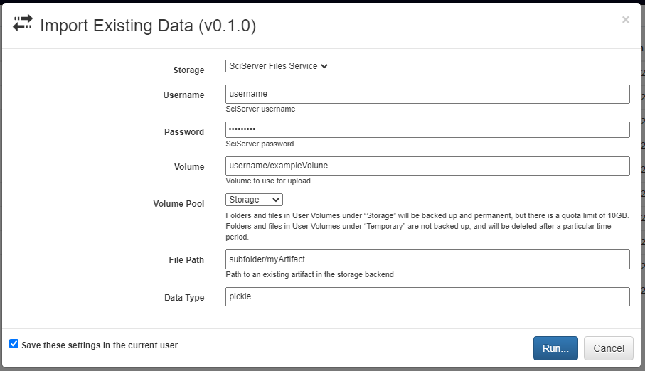
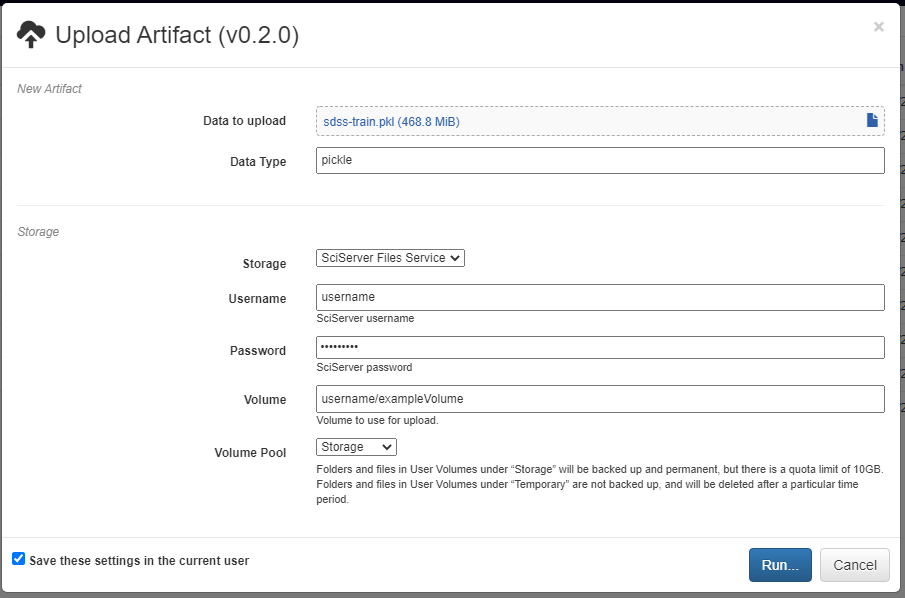

Custom Utils
------------
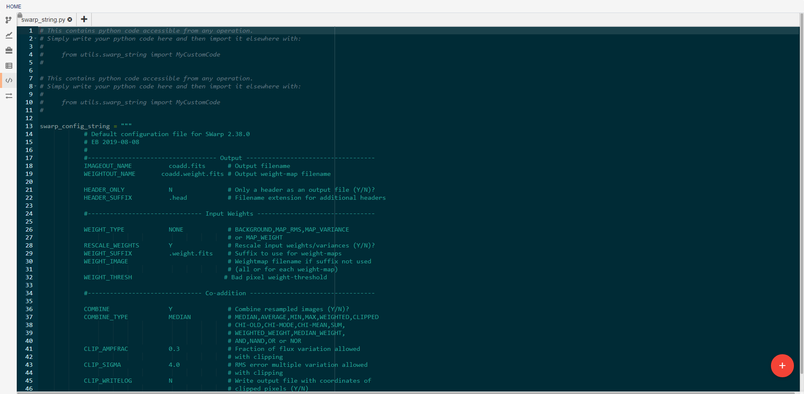

This view allows the creation and editing of custom utility modules. Utilities created here can be imported into any pipeline operation. For example, the *swarp_config_string* shown above can be printed out in a operation using the following code:

.. code-block:: python

    import utils.swarp_string as ss
    print(ss.swarp_config_string)

Custom Serialization
--------------------
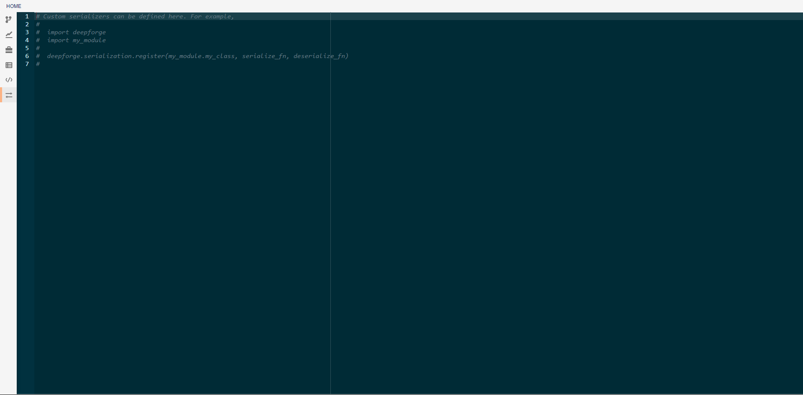

In this view, you can create custom serialization protocols for the creation and use of artifacts that are neither python pickle objects nor keras models. To create a serialization, you will need to define two functions, one for serialization and one for deserialization. These functions must then be passed as arguments to the *deepforge.serialization.register* function as shown in the commented code above. The serializer and deserializer should have the same signatures as the dump and load functions respectively from python's `pickle module <https://docs.python.org/3/library/pickle.html>`_.
