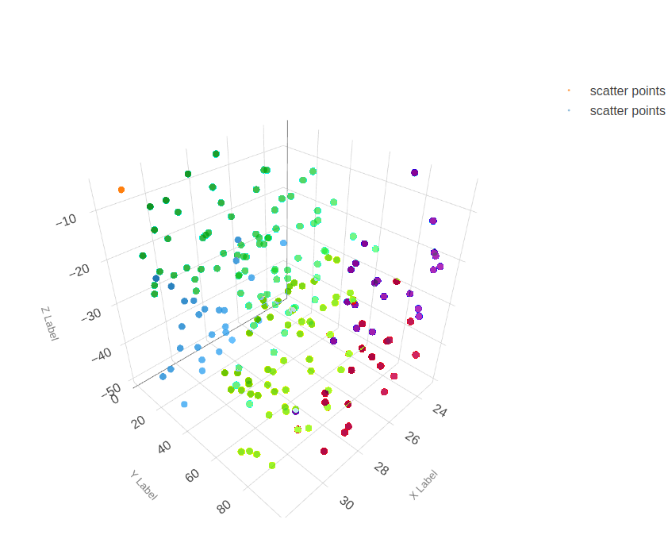
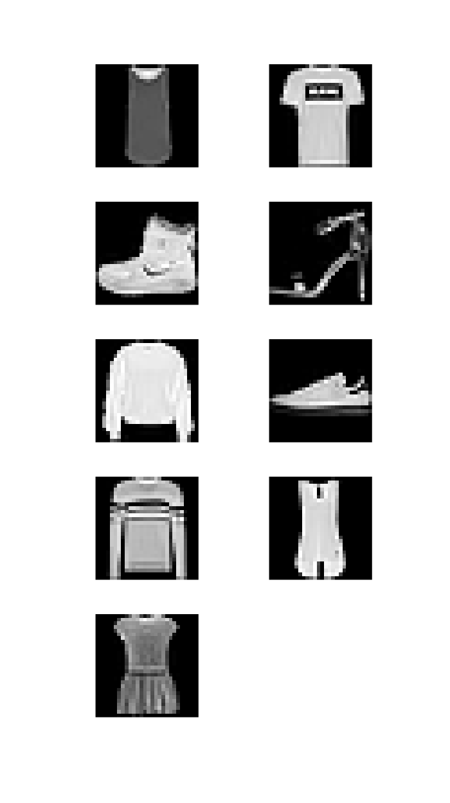

Operation Feedback
==================
Operations can provide a variety of forms of real-time feedback including subplots, 2D and 3D plots and images using :code:`matplotlib`.

Graphs
------
The following example shows a sample 3D scatter plot and its rendering in DeepForge.

.. code-block:: python

    import matplotlib.pyplot as plt
    import numpy as np
    from mpl_toolkits.mplot3d import Axes3D

    class Scatter3DPlots():

        def execute(self):
            # Set random seed for reproducibility
            np.random.seed(19680801)

            def randrange(n, vmin, vmax):
                '''
                Helper function to make an array of random numbers having shape (n, )
                with each number distributed Uniform(vmin, vmax).
                '''
                return (vmax - vmin)*np.random.rand(n) + vmin

            fig = plt.figure()
            ax = fig.add_subplot(111, projection='3d')

            n = 100

            # For each set of style and range settings, plot n random points in the box
            # defined by x in [23, 32], y in [0, 100], z in [zlow, zhigh].
            for m, zlow, zhigh in [('o', -50, -25), ('^', -30, -5)]:
                xs = randrange(n, 23, 32)
                ys = randrange(n, 0, 100)
                zs = randrange(n, zlow, zhigh)
                ax.scatter(xs, ys, zs, marker=m)

            ax.set_xlabel('X Label')
            ax.set_ylabel('Y Label')
            ax.set_zlabel('Z Label')
            plt.show()

    Example of a 3D scatter plot using matplotlib in DeepForge

Images
------
Visualizing images using `matplotlib` is also supported. The following example shows images from the `MNIST fashion dataset`.

.. code-block:: python

    from matplotlib import pyplot
    from keras.datasets import fashion_mnist

    class MnistFashion():

        def execute(self):

            (trainX, trainy), (testX, testy) = fashion_mnist.load_data()
            # summarize loaded dataset
            print('Train: X=%s, y=%s' % (trainX.shape, trainy.shape))
            print('Test: X=%s, y=%s' % (testX.shape, testy.shape))
            for i in range(9):
                pyplot.subplot(330 + 1 + i)  # define subplot
                pyplot.imshow(trainX[i], cmap=pyplot.get_cmap('gray'))  # plot raw pixel data
            pyplot.show()

    Visualizing MNIST fashion images in DeepForge
