CIFAR-10 Classifier
-------------------
This guide provides step-by-step instructions on how to create full pipeline for training and evaluating a simple image classification neural network. This example uses the `CIFAR-10 dataset <https://www.cs.toronto.edu/~kriz/cifar.html>`_. This guide assumes that the reader has a basic understanding of the DeepForge interface. New users are recommended to review the `step-by-step guides <introduction.rst>`_ before attempting the process described in this guide.

Pipeline Overview
=================
.. figure:: images/cifar-pipeline-blank.png
    :align: center
    :scale: 50 %

This guild will give a step-by-step process beginning with a new, blank pipeline (shown above) and ending with the pipeline shown below that will create, train, and evaluate a CIFAR-10 classifier.

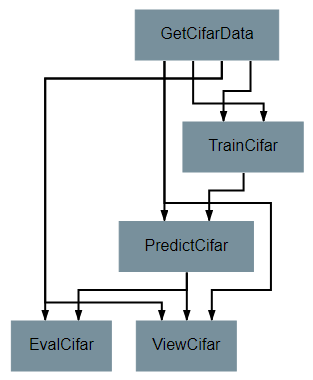

GetCifarData Operation
======================
To create your first operation, click on the floating red button in the bottom right of the pipeline editor workspace, and click on the *New Operation* option that appears.

This operation provides the pipeline with the training and testing data that will be used by later operations. In many cases, this will be accomplished with *Input* operations, but it may be preferable in some cases to retrieve the data programmatically.

The first step in any operation should be giving it a name, defining its attributes, and defining its inputs and outputs. These steps are best performed in the right-side panel in the operation editor.

Our GetCifarData operation will produce four outputs, representing the images and labels from the training and testing sets. This operation does not require any inputs or attributes.

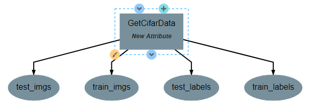

The next step in creating any operation is defining its implementation. This is performed in the left panel using the python programming language. Every operation is defined as a python class that must include an *execute* function. Any arbitrary code can be included and run in association with this operation, but an *execute* function must be included and external code will only run if called from within the *execute* function.

CIFAR-10 is a very common benchmarking dataset. As such, the common keras neural network python library provides a simple method for directly downloading and using the data. The code for doing this is relatively straightforward and is shown below.

.. code-block:: python

    from keras.datasets import cifar10

    class GetCifarData():

        def execute(self):
            print('Retrieving CIFAR-10 train_imgs')
            
            # Retrieve CIFAR-10 data. load_data() returns a 2-tuple of 2-tuples. The
            # left hand side decomposes these tuples into four separate variables.
            (train_imgs,train_labels),(test_imgs,test_labels) = cifar10.load_data()
            
            print('CIFAR-10 train_imgs successfully retrieved')
            print('Training set shape: {shape}'.format(shape=train_imgs.shape))
            print('Testing set shape: {shape}'.format(shape=test_imgs.shape))
            
            return train_labels, test_imgs, test_labels, train_imgs 

When finished, return to the pipeline and use the add operation button again to add the new operation to the pipeline. At this point, you should have a single operation with four outputs, as shown below:

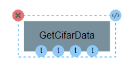

TrainCifar Operation
====================
The next operation will create and train the neural network classifier.

Once again, our first step after naming is to define the inputs and outputs of the operation. Unlike the previous operation, two attributes should be added: *batch_size* and *epochs*. Batch size is the number of training samples that the model will be trained on at a time and epochs is the number of times that each training sample will be given to the model. Both are important hyperparameters for a neural network. For this guide, the attributes are defined as shown below, but the exact number used for default values can be changed as desired by the reader.

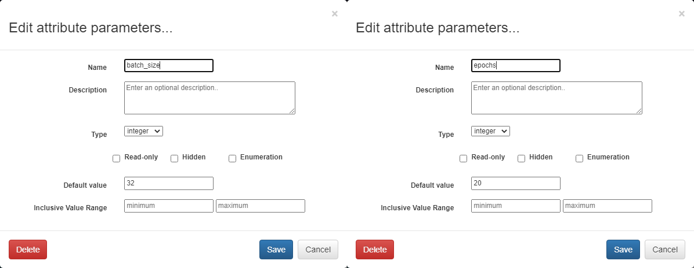

This operation will require two inputs (images and labels) and a neural network architecture. Finally, the operation produces one output, which is the trained classifier model. After all inputs, outputs, and attributes have been added, the structure of the operation should appear similar to the following:

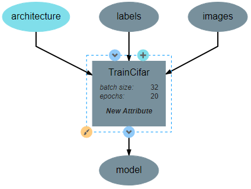

The code for this operation follows the standard procedure for creating and training a Keras network. The code for this process is shown below. Note that the attributes must be assigned as class variables in the *__init__* function in order to be used in the *execute* function. Also note that we do not need to import the keras library explicitly here. This is because the architecture object already comes with all the currently needed keras functions attached.

.. code-block:: python

    class TrainCifar():
        
        # Runs when preparing the operation for execution
        def __init__(self, architecture, batch_size=32, epochs=20):
            print("Initializing Trainer")
            
            # Saves attributes as class variables for later use
            self.arch = architecture
            self.epochs = epochs
            self.batch_size = batch_size
            return

        # Runs when the operation is actually executed
        def execute(self, images, labels):
            print("Initializing Model")
            
            # Creates an instance of the neural network architecure. Other
            # losses and optimizers can be used as desired
            self.arch.compile(loss='sparse_categorical_crossentropy',
                            optimizer='adam',
                            metrics=['sparse_categorical_accuracy'])
            print("Model Initialized Successfully")
            
            print("Beginning Training")
            print("Training images shape:", images.shape)
            print("Training labels shape:", labels.shape)

            # Train the model on the given inputs (images) and outputs (labels)
            # using the specified training options.
            self.arch.fit(images,
                        labels,
                        batch_size=self.batch_size,
                        epochs=self.epochs,
                        verbose=2)

            print("Training Complete")

            # Saves the model in a new variable. This is necessary so that the
            # output of the operation is named 'model'
            model = self.arch
            
            return model

After the operation is fully defined, it needs to be added to the workspace and connected to the **GetCifarData** operation as shown below. Specifically, the *train_images* and *train_labels* outputs from **GetCifarData** should be connected to the *images* and *labels* inputs to **TrainCifar** respectively. Hovering over the circles representing each input or output will display the full name of that element. This should help to ensure that the correct inputs and outputs are matched together.

Note that the architecture selected from within the pipeline editor until after the `Neural Network Architecture`_ section of this guide is completed.

.. figure:: images/cifar-gt.png
    :align: center
    :scale: 50 %

Neural Network Architecture
===========================

This section will describe how to create a simple, but effective, Convolutional Neural Network for classifying CIFAR-10 images. In particular, this section gives instructions on creating a slightly simplified `VGG network <https://neurohive.io/en/popular-networks/vgg16/>`_. The basic structure of this network is a series of four feature detection blocks, followed by a densely connected classifier block.

For specifics on how to create a new network how to use the neural network editor interface, consult the `Creating Neural Networks <creating-neural-networks.rst>`_ walkthrough.

Beginning from a blank network, the first step when building a network is to create an Input layer by clicking anywhere on the workspace.

For reference during design, the full architecture can be found `here <images/vgg-full.png>`_.

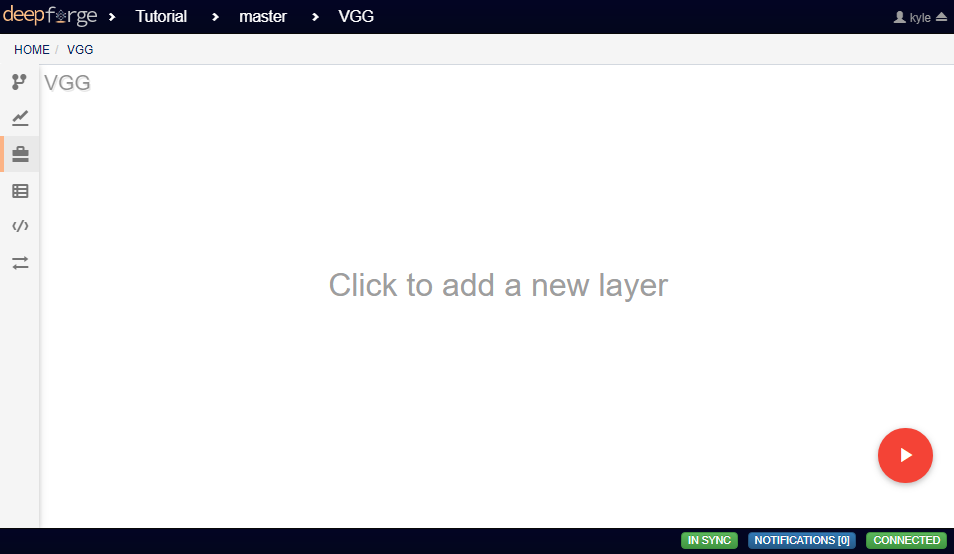

This Input layer requires that either the *shape* or *batch_shape* attributes be defined. Because our data is composed of 32*32 pixel RGB images, the *shape* of our input should be (32,32,3).

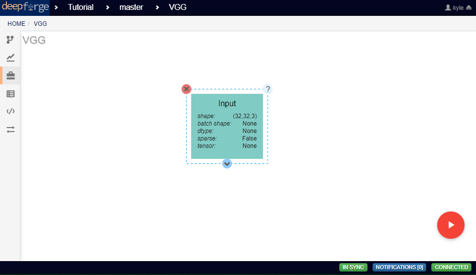

The four feature detector blocks are each composed of two **Conv2D** layers followed by a **MaxPooling2D** layer. The settings for the first **Conv2D** and **MaxPooling2D** layers are shown below.

Every **Conv2D** layer requires that the *filters* and *kernel_size* attributes be defined. Each **Conv2D** layer in this network will use a *kernel_size* (window size) of (3,3), a stride of (1,1), and will use ReLU as the activation function. They should all also use *same* as the padding so that the size of the input does not change during convolution. For the first pair of **Conv2D** layers, the number of filters will be 32.

.. figure:: images/vgg-block-conv.png
    :align: center
    :scale: 50%

Every **MaxPooling2D** layer requires that the *pool_size* (window size) attribute be defined. In this network, all **MaxPooling2D** layers will use a pool_size of (2,2), a stride of (2,2), and padding set to *valid*. These settings will result in the size of the image being cut in half at every pooling.

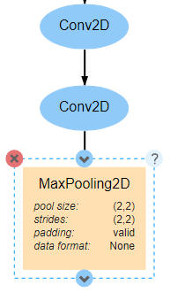

A total of four of these convolutional blocks should be created in sequence. The only difference between each block is that the number of filters used in the **Conv2D** layers in each block should double after each pooling. In other words, the value of *filters* should be 32 for the first **Conv2D** layer, 64 for the third **Conv2D** layer, 128 for the fifth, and so on.

After the last convolutional block comes the classifier block. The first layer in this block is a **Flatten** layer, which converts the convolved image into a 1D vector that can be fed into the following **Dense** layers. The **Flatten** layer has no attributes to change.

There are a total of three **Dense** layers in this classifier, with the first two using the same attribute values. Every **Dense** layer requires that the *units* (output length) attribute be defined.

For the first two **Dense** layers, the number of units used will be 2048, and the activation function used will be ReLU, as shown below.

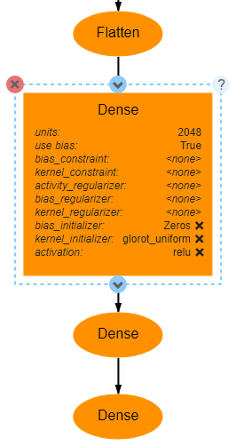

The final **Dense** layer will actually provide the output probability density function for the model. As such, the number of units should be the number of categories in the data (in this case 10). This last layer also uses the *softmax* activation function, which ensures that the output is a vector whose sum is 1.

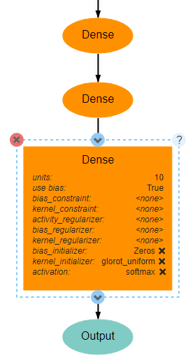

Optionally, an **Output** layer may be added after the final **Dense** layer. This layer explicitly marks the output of a model, but may be excluded when there is only one output. When there is only one output, such as in this network, the lowest layer in the model will be assumed to be the output layer.

PredictCifar Operation
======================

This operation uses the model created by **TrainCifar** to predict the class of a set on input images. This operation has no attributes, takes a model and images as input and produces a set of predicted labels (named *pred_labels*), resulting in the following structure:

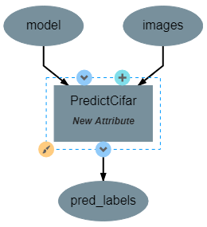

The code for this operation is short and straightforward with only one peculiarity. The *predict* function does not provide a prediction directly, instead providing a `probability density function (pdf) <https://en.wikipedia.org/wiki/Probability_density_function>`_ over the available classes. For example, a CIFAR-10 classifier's output for a single input may be [0, 0.03, 0.9, 0.02, 0, 0, 0.05, 0, 0, 0], which indicates that the model is predicting that the likelihood that the image falls into each category is 0% for category 1, 3% for category 2, 90% for category 3, and so on. This requires taking the argmax of every output of the model to determine which class has been ruled the most likely.

.. code-block:: python

    import numpy as np

    class PredictCifar():

        def execute(self, images, model):
            print('Predicting Image Categories')
            
            # Predicts the PDF for the input images
            pred_labels = model.predict(images)
            
            # Converts PDFs into scalar predictions
            pred_labels = np.argmax(pred_labels, axis=1)

            print('Predictions Generated')
            
            return pred_labels

After the operation is fully defined, it needs to be added to the workspace and connected to the previous operations as shown below. Specifically, the *test_images* outputs from **GetCifarData** and the *model* output from **TrainCifar** should be connected to the *images* and *model* inputs to **PredictCifar** respectively.

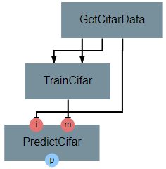

EvalCifar Operation
===================

This operation evaluates the outputs from the classifier and produces a confusion matrix that could be helpful for determining where the shortcomings of the model lie.

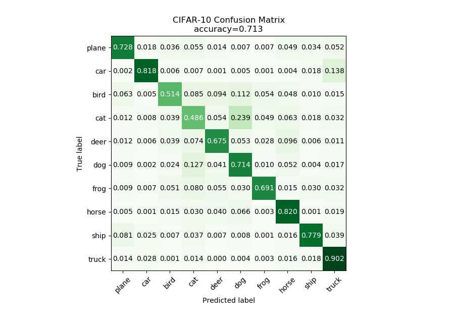

This operation requires no attributes and produces no output variables. It requires two inputs in the form of *true_labels* and *pred_labels*. The structure of this operation is shown below:

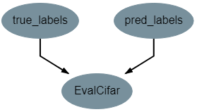

With this operation, the code becomes a bit more complex as we build the visualization with the tools provided by the `matplotlib.pyplot library <https://matplotlib.org/tutorials/introductory/pyplot.html>`_. The code below is annotated with comments describing the purpose of all graphing commands. Also of note is that the expected input *true_labels* is a 2-dimensional array, where the second dimension is of length 1. This is because of a quirk of keras that requires this structure for training and automatic evaluation. To ease calculations, the first step taken is to flatten this array to one dimension.

.. code-block:: python

    import matplotlib.pyplot as plt
    import numpy as np

    class EvalCifar():

        def execute(self, pred_labels, true_labels):
            
            # Reduces the dimensionality of true_labels by 1
            # ex. [[1],[4],[5],[2]] becomes [1, 4, 5, 2]
            true_labels = true_labels[:,0]
        
            # Builds a confusion matrix from the lists of labels
            cm = self.buildConfustionMatrix(pred_labels, true_labels)

            #normalize values to range [0,1]
            cm = cm / cm.sum(axis=1)

            # Calculates the overall accuracy of the model
            # acc = (# correct) / (# samples)
            acc = np.trace(cm) / np.sum(cm)

            # Display the confusion matrix as a grayscale image, mapping the
            # intensities to a green colorscale rather than the default gray 
            plt.imshow(cm, cmap=plt.get_cmap('Greens'))
            
            # Adds a title to the image. Also reports accuracy below the title
            plt.title('CIFAR-10 Confusion Matrix\naccuracy={:0.3f}'.format(acc))

            # Labels the ticks on the two axes (placed at positions [0,1,2,...,9]) with
            # the category names
            bins = np.arange(10)
            catName = ['plane','car','bird',
                    'cat','deer','dog','frog',
                    'horse','ship','truck']
            plt.xticks(bins, catName, rotation=45)
            plt.yticks(bins, catName)

            # Determines value at the center of the color scale
            mid = (cm.max() + cm.min()) / 2

            for i in range(10):
                for j in range(10):
                    # Prints the value of each cell to three decimal places.
                    # Colors text so that white text is printed on dark cells
                    # and black text on light cells
                    plt.text(j, i, '{:0.3f}'.format(cm[i, j]),
                            ha='center', va='center',
                            color='white' if cm[i, j] > mid else 'black')
            
            # Labels the two axes
            plt.ylabel('True label')
            plt.xlabel('Predicted label')
            
            plt.tight_layout()
            
            # Displays the plot
            plt.show()

        def buildConfustionMatrix(self, pred_labels, true_labels):
            # Creates an empty matrix of size 10 x 10
            mat = np.zeros((10,10))
            
            # Computes count of times that image with true label t is
            # assigned predicted label p
            for p, t in zip(pred_labels, true_labels):
                mat[t][p] += 1
                
            return mat

After the operation is fully defined, it needs to be added to the workspace and connected to the previous operations as shown below. Specifically, the *test_labels* outputs from **GetCifarData** and the *pred_labels* output from **PredictCifar** should be connected to the *true_labels* and *pred_labels* inputs to **EvalCifar** respectively.

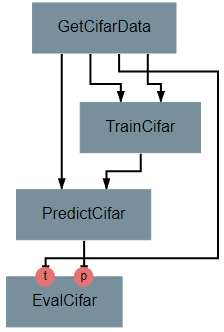

ViewCifar Operation
===================

This operation displays a random subset of images, along with the predicted and actual categories in which those images belong. Such a visualization might be helpful for seeing what kind of images are being misclassified and for what reason.

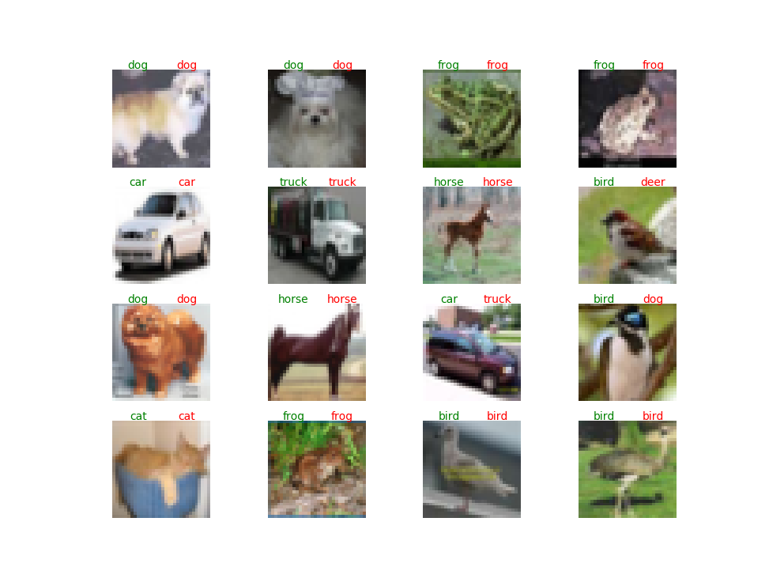

This operation includes an attribute *num_images* for specifying the number of images that should be drawn from the testing set and displayed. As with the attributes in TrainCifar, this attribute should be given a type of integer and will be given the default value of 16.

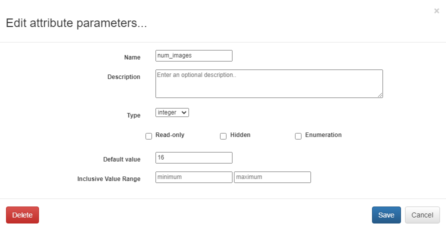

This operation produces no outputs and requires three inputs: the images, the associated true labels, and the associated predicted labels. The overall structure is shown.

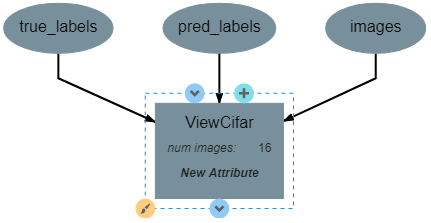

As with the previous operation, the code for this operation gets slightly complicated and has been annotated with comments describing each command.

.. code-block:: python

    from matplotlib import pyplot as plt
    import numpy as np
    import math

    class ViewCifar():
        def __init__(self, num_images=16):
            self.num_images = num_images
            
            return

        def execute(self, pred_labels, true_labels, images):
            # Reduces the dimensionality of true_labels by 1
            # ex. [[1],[4],[5],[2]] becomes [1, 4, 5, 2]
            true_labels = true_labels[:,0]
            
            # Chooses a random selection of indices representing the chosen images
            orig_indices = np.arange(len(images))
            indices = np.random.choice(orig_indices, self.num_images, replace=False)
            
            # Extracts the images and labels represented by the chosen indices
            images = np.take(images, indices, axis=0)
            pred_labels = np.take(pred_labels, indices, axis=0)
            true_labels = np.take(true_labels, indices, axis=0)
            
            # Calculates the number of rows and columns needed to arrange the images in
            # as square of a shape as possible
            num_cols = math.ceil(math.sqrt(self.num_images))
            num_rows = math.ceil(self.num_images / num_cols)
            
            # Creates a collection of subplots, with one cell per image
            fig, splts = plt.subplots(num_rows, num_cols, sharex=True, sharey=True)
            
            catName = ['plane','car','bird',
                       'cat','deer','dog','frog',
                       'horse','ship','truck']
            
            for i in range(self.num_images):

                # Determines the current row and column location
                col = i % num_cols
                row = i // num_cols
                
                # Displays the current image
                splts[row,col].imshow(images[i])
                splts[row,col].axis('off')
                
                # Retrieves the text label equivalent of the numerical labels
                p_cat = catName[pred_labels[i]]
                t_cat = catName[true_labels[i]]
                
                # Displays the category labels, with the true label colored green and in
                # the top-left corner and the predicted label colored red and in the 
                # top-right corner
                splts[row,col].text(8,0,t_cat,ha='center',va='bottom',color='green')
                splts[row,col].text(24,0,p_cat,ha='center',va='bottom',color='red')
            
            # Displays the figure
            plt.show()

After the operation is fully defined, it needs to be added to the workspace and connected to the previous operations as shown below. Specifically, the *test_labels* outputs from **GetCifarData**, the *test_images* from **GetCifarData**, and the *pred_labels* output from **PredictCifar** should be connected to the *true_labels*, *images*, and *pred_labels* inputs to **ViewCifar** respectively.

With this, we have a full pipeline ready for execution.

Execution and Results
=====================

With the pipeline fully prepared, it is time to execute the pipeline. To do this, go to the pipeline editor workspace, hover over the red *Add Operation* button and click the floating blue *Execute Pipeline* button

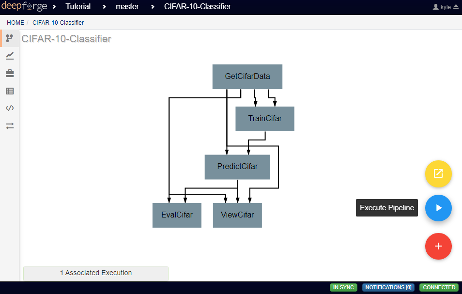

A dialog box will open where the settings for the current execution must be defined. All inputs are required are detailed below.

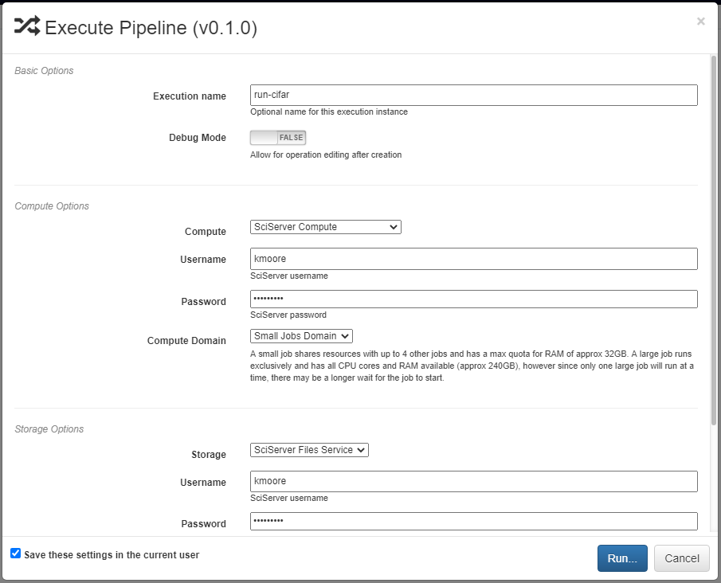

The *Basic Options* section includes two settings. The first is the name to be used for identifying the execution. An execution's name must be unique within the project and if a name is given here that has already been used for an execution in the same project, a number will be appended to the given name automatically. The debug option allows for individual operations to be edited and rerun after execution. This is useful during pipeline development and allows for easier debugging or tuning.

The *Compute Options* section allows configuration of the compute backend to be used for execution. The specific inputs required here will vary with the selected compute backend. For instance, the `SciServer Compute <https://www.sciserver.org/about/compute/>`_ backend requires login credentials and the selection of a compute domain.

.. figure:: images/cifar-execute-compute.png
    :align: center
    :scale: 50%

The *Storage Options* section allows configuration of the storage backend to be used during execution. This backend will be where all files used during execution and created as output from the pipeline will be stored. The specific inputs required here will vary with the selected compute backend. For instance, the **SciServer Files Service** backend requires login credentials, the selection of a storage volume, and the type of the volume.

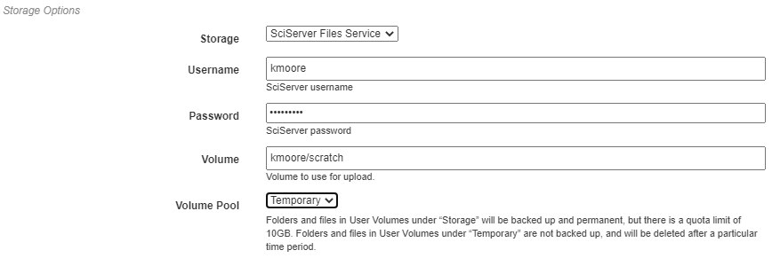

When all settings have been specified, click **Run** to begin execution. For information on how to check execution status, consult the `Viewing Executions <viewing-executions.rst>`_ walkthrough.

To view the output of the execution, go to the *Executions* tab and check the box next to the desired execution.

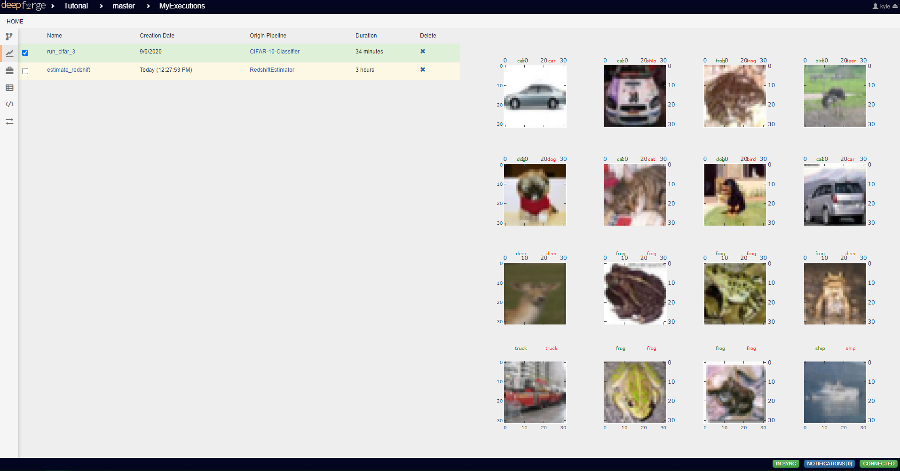

For a more detailed and larger view of individual figures, click on the name of the execution to view its status page and open the console output for the desired operation. In the bottom left is a set of buttons for switching between console output and graph output for that operation.

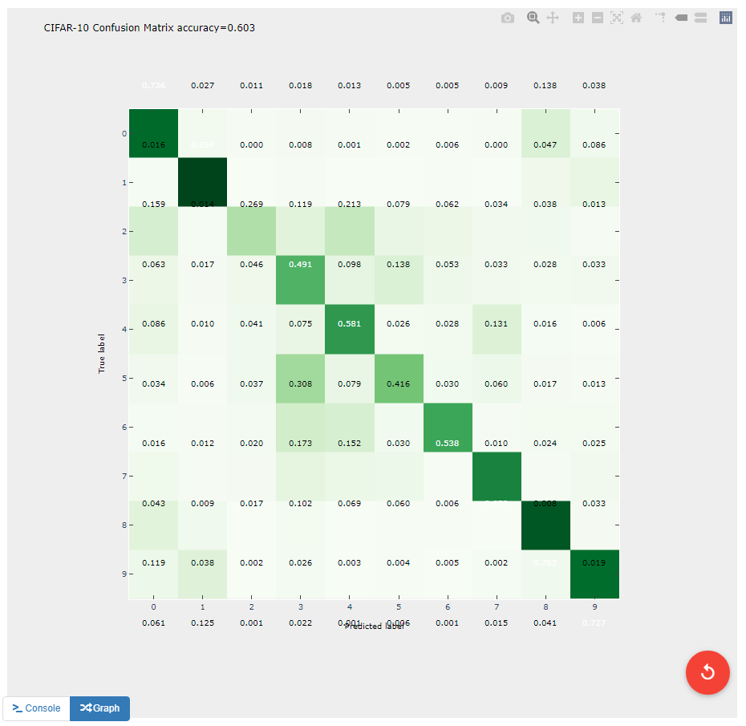
