Creating Neural Networks
------------------------

This page will guide you through the steps needed to create a neural network architecture for use in pipelines.

Importing Resource Libraries
~~~~~~~~~~~~~~~~~~~~~~~~~~~~
Neural networks and other models can be created from the *Resources* tab on the sidebar. Before any models can be created in this tab, you must import the associated library into the project using the red floating button in the bottom right of the workspace.

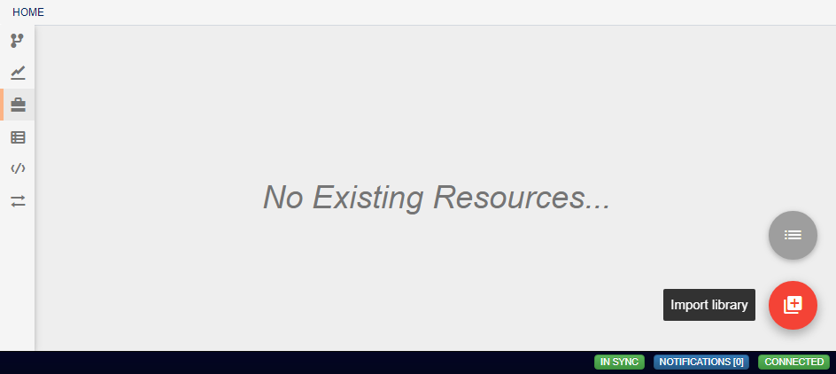

In the box that appears, you will see a list of libraries that are available for import.

.. figure:: images/resources-import-keras.png
    :align: center
    :scale: 50%

Clicking the download icon will install that library and allow creation of associated models. The keras library, for instance, allows for the creation of neural network models.

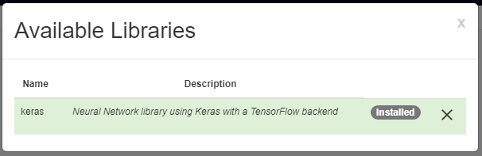

Creating a New Architecture
~~~~~~~~~~~~~~~~~~~~~~~~~~~
After any library has been imported, new models can be created by hovering over the import library button and clicking the floating blue button that appears. This will generate a blank model and automatically open up that model's workspace.

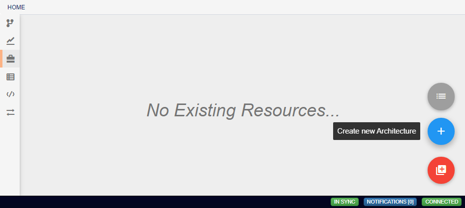

Clicking anywhere in the workspace will add the first layer of the architecture, which will always be an input layer. Just as with pipelines, these architectures are represented by a flowchart, with each node representing a single layer in the neural network.

.. figure:: images/vgg-blank.png
    :align: center
    :scale: 50%

Editing Network Layers
~~~~~~~~~~~~~~~~~~~~~~
Clicking on a layer allows for changing the parameters of that layer. Many of these parameters can be left undefined, but many layers require that some specific parameters be given. If a layer has not been supplied with the necessary parameters, or if there is some other error encountered at that layer when building the network, the layer will be highlighted with a red border. Hovering the mouse over the layer will reveal the error. Hovering over a newly created **Input** layer, for example, shows us that the layer requires that either the shape or batch_shape parameter must be defined.

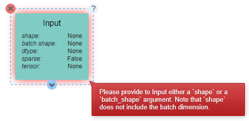

Some parameters may not be immediately clear on their effects from the name alone. For unfamiliar parameters, hovering over the name of the parameter will reveal a short description.

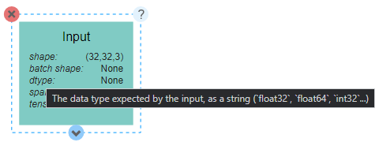

In addition, clicking on the **?** icon in the top right of the expanded layer will display documentation on the layer as a whole, including descriptions of all available parameters.

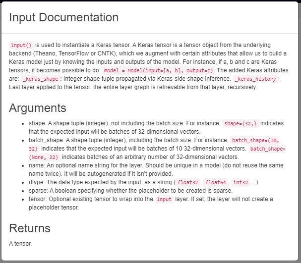

Adding Additional Layers
~~~~~~~~~~~~~~~~~~~~~~~~
To add additional layers, you can click on the arrow icons on the top or bottom of any layer. The icon should become a + icon and clicking again will open a menu from which the desired layer type can be chosen.

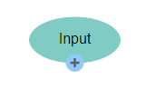

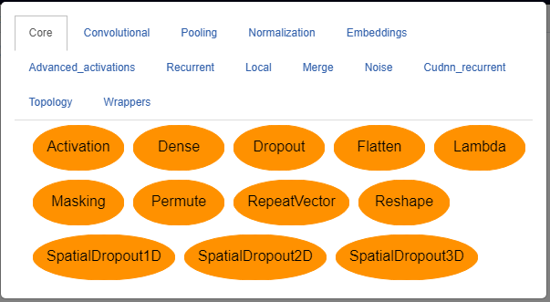
 
Layers can also be removed from the network by expanding the layer and clicking the red X icon in the top left. Two layers that already exist in the network can also be linked by clicking on the output icon on one layer and the input icon on another. A given layer can have any number of other layers as inputs or outputs. Some layers, such as the **Dense** layer, however, only expect one input and will give an error when multiple inputs are detected.

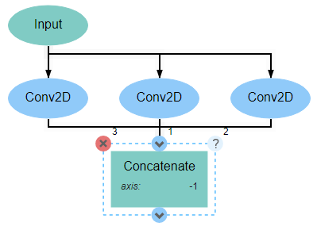

It is optional, though recommended, that the network be concluded with an **Output** layer. A network may include multiple outputs, in which case all outputs must be given an **Output** layer. If no **Output** layer is included, the last layer in the network will be treated as the sole output.

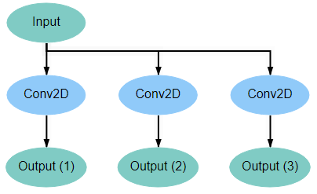

Connections Between Layers
~~~~~~~~~~~~~~~~~~~~~~~~~~
When two layers are connected, they will be joined by a black arrow that indicates the flow of data through the network. Hovering over these arrows will reveal the shape of the data, which can help with analyzing the network to ensure that the data is being transformed as desired.

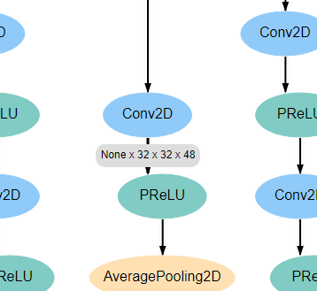

Connections can also be removed and layers separated by clicking on the unwanted arrow and then clicking on the red X icon that appears.

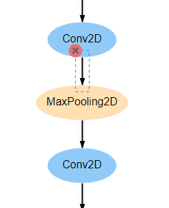

Exporting Architectures
~~~~~~~~~~~~~~~~~~~~~~~
With keras models, another feature exists to export the model as python code. Clicking the red arrow button in the bottom right of the workspace will display a window generating the code. After making any optional changes to the configuration, clicking run will generate the code.

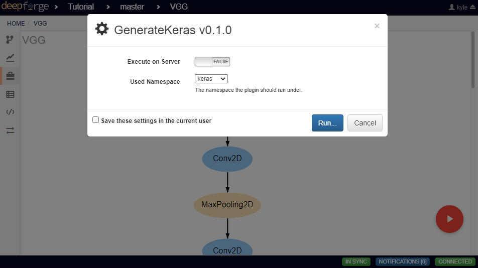

After successful generation, hovering over the red arrow button and clicking on the floating gray list button will provide a list of all exported architectures.

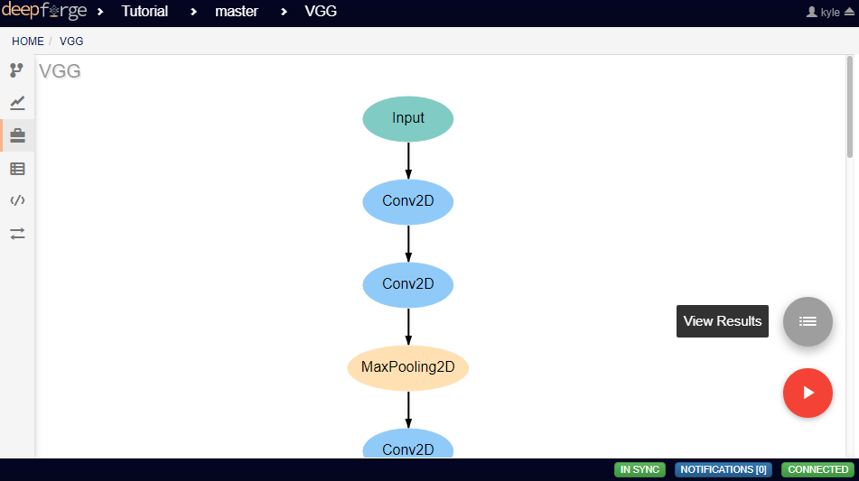

Clicking on *Details* will provide some metadata about the export, as well as a link to download the generated file. This file can then be incorporated into a python project.

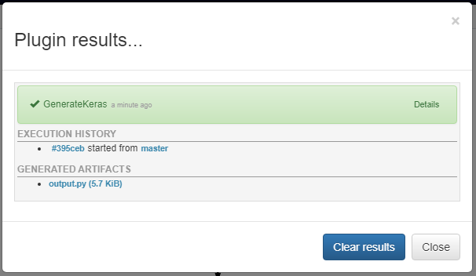
