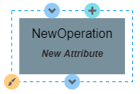
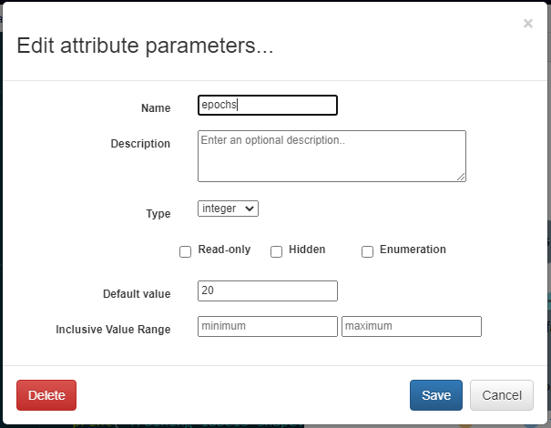
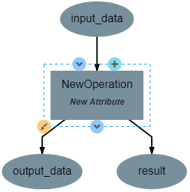
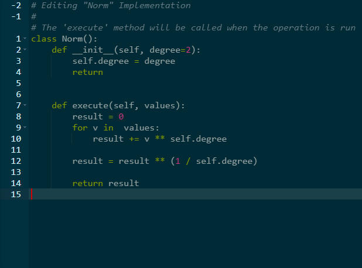
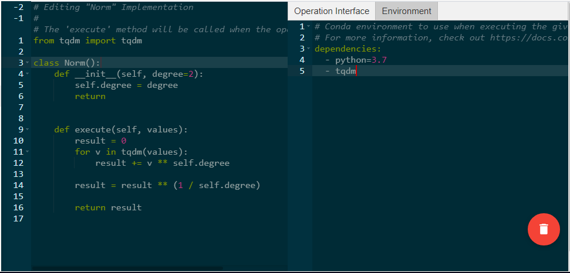

Creating Operations
-------------------

When adding an operation to a pipeline, new operations can be created by clicking the *New Operation* option. This will open the operation editor for the new operation.

.. figure:: images/cifar-pipeline-blank.png
    :align: center
    :scale: 50%

This editor can also be reached for existing operations by clicking the **</>** icon when editing an operation's attributes.

.. figure:: images/cifar-operation-io.png
    :align: center
    :scale: 50%

This editor has two primary views for editing the operation. The left view allows editing the underlying code of the operation directly. The right view provides a graphical means of adding inputs, outputs, and attributes.

.. figure:: images/new-operation.png
    :align: center
    :scale: 50%

Editing the Operation Interface
~~~~~~~~~~~~~~~~~~~~~~~~~~~~~~~

Clicking on the operation in the right view will allow editing the operation interface. The operation interface consists of design time parameters (attributes and references) as well as inputs and outputs generated at runtime.

Attributes can be added by clicking the *New Attribute* label, which will open a dialog box where you can define the name, type, default value, and other metadata about that attribute. This dialog box can be viewed again to edit the attribute by clicking on the name of the attribute in the right-side view.

Inputs and outputs can be added using the blue arrow icons. Any number of inputs and outputs can be added to an operation, but each should be given a unique name.

Using the plus icon, referencess to resources can be added to the operation. These resources will usually be some form of neural network. As with inputs and outputs, any number of resources can be added to an operation.

.. figure:: images/train-cifar-io.png
    :align: center
    :scale: 50%

The paint brush icon allows editing the color of the operation, but this is purely aesthetic and does not affect the operation's underlying logic.

Implementing the Operation
~~~~~~~~~~~~~~~~~~~~~~~~~~

In the left-side view, the underlying logic of the operation is implemented using Python. The code here can be edited freely. All operations are defined by a class with the same name as the operation. This class has two primary functions associated with it. The first is the *__init__* function, which will appear automatically when creating the operation's first attribute. This function will run when the operation is initialized and is primarily used for the creation of class variables and the processing of attributes. Note that operation attributes will not be accessible from other functions and must be assigned to a class variable in this function to be utilized elsewhere. The second primary function is the *execute* function. This is the function that is executed when the operation is running. Any number of other classes and functions can be created in the code editor, but they will not be executed if they are not called within the execute function. The outputs of the execute function will also be the outputs of the operation.

Importing Libraries
~~~~~~~~~~~~~~~~~~~

Python libraries can be used within an operation by importing them, which is usually done above the operation class. Any library that is installed on the compute backend's python environment can be imported as normal, but more niche libraries that are available through pip or anaconda need to be specified as dependencies for the operation by clicking the *Environment* tab on the right side. The dependencies described here should be defined using the same syntax as in a `conda environment file <https://conda.io/projects/conda/en/latest/user-guide/tasks/manage-environments.html#creating-an-environment-file-manually>`_.

