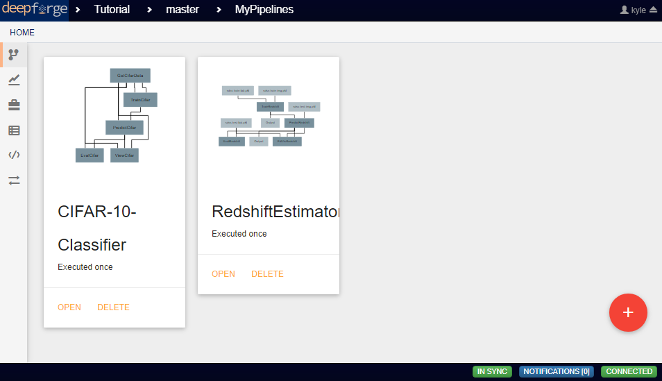
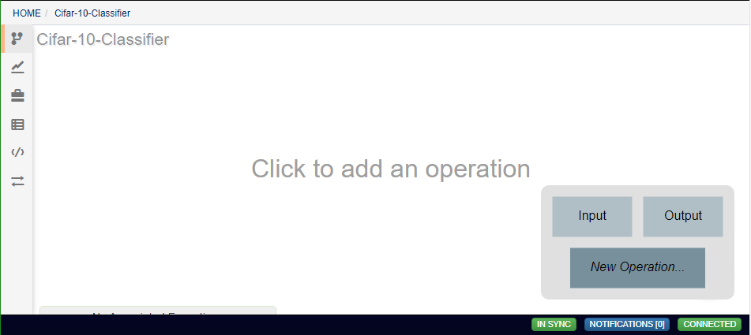
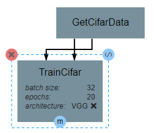
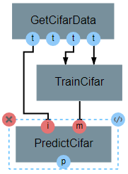

Creating Pipelines
------------------
From the home view in the *Pipelines* tab, you are presented with a list of the pipelines that have already been created. Clicking on any of these pipelines will allow editing of that pipeline. To create a new, empty pipeline, click on the red button in the bottom right corner of the workspace.

The basic unit of work in a pipeline is the operation. Operations can be added using the red button in the bottom right corner of the workspace.

After an operation has been added, the attributes of that operation can be changed by clicking on the operation and then clicking on the current value of that attribute.

Operation inputs and outputs are represented by blue circles that are visible after clicking on the operation. Blue circles on the top on the operation represent inputs, while circles on the bottom represent outputs. The red X circle can be clicked to remove an operation from the pipeline. This does not remove it from the set of available operations. The **</>** icon will open the operation editor view. Holding alt while clicking this icon will instead create a copy of the operation and open the new copy's editor.

Operations can be connected by clicking on an input or output of an operation before clicking on an output or input respectively of another operation. All input and output connections are optional, though missing outputs may give errors depending upon the operation's internal logic.
