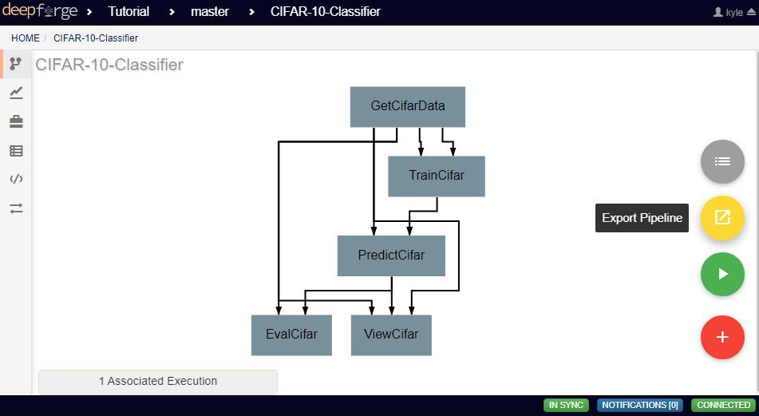
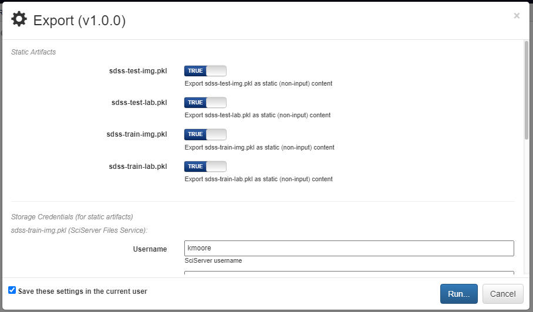

Executing Pipelines
-------------------

This page will guide you through the steps needed to execute a finished pipeline.

Executing within DeepForge
~~~~~~~~~~~~~~~~~~~~~~~~~~
Finished pipelines can be conveniently executed from within DeepForge. To do so, navigate to the desired pipeline's workspace, hover over the red + button in the bottom right, and click on the blue arrow button. This will open a dialog box for defining how to execute the pipeline. The configuration options are split into several sections. Once all information has been provided, clicking the blue *Run* button will begin execution. The information provided can also be saved for future executions by checking the box in the bottom left.

.. figure:: images/cifar-execute-dialog.png
    :align: center
    :scale: 50%

Basic Options
^^^^^^^^^^^^^
Here you will define the name of the execution. Execution names are unique identifiers and cannot be repeated. In the case that a name is given that has already been used for that project, an index will be added to the pipeline name automatically (i.e. *test* becomes *test_2*). Upon starting execution, the execution name will also be added to the project version history as a tag.

The pipeline can also be chosen to run in debug mode here. This will allow editing the operations and re-running the pipelines with the edited operations after creation. Alternatively, the execution will only use the version of each operation that existed when the pipeline was first executed. This can be helpful when creating and testing pipelines before deployment.

.. figure:: images/cifar-execute-basic.png
    :align: center
    :scale: 50%

Credentials for Pipeline Inputs
^^^^^^^^^^^^^^^^^^^^^^^^^^^^^^^
This section requires inputting the credentials for accessing all artifacts used in the pipeline. Because each artifact can be located in different storage backends or different accounts within that backend, each artifact must be provided with its own credentials. If no input artifacts are used in the pipeline, this section will not be present.

.. figure:: images/redshift-execute-creds.png
    :align: center
    :scale: 50%

Compute Options
^^^^^^^^^^^^^^^
In this section, you will select from the available compute backends. In the examples shown, for instance, the SciServer Compute service will be used. Each compute backend may require additional information, such as login credentials or computation resources that should be used.

.. figure:: images/cifar-execute-compute.png
    :align: center
    :scale: 50%

Storage Options
^^^^^^^^^^^^^^^
Here, the storage backend must be chosen from the available options. As with the compute options, SciServer's Files Service is used here as an example. Each backend may require additional input, such as login credentials and the desired storage location. This storage backend and location will be where all files created during execution will be stored. This will include both files used during execution, such as data passed between operations, as well as artifacts created using Output operations.

.. figure:: images/cifar-execute-storage.png
    :align: center
    :scale: 50%

Manual Execution
~~~~~~~~~~~~~~~~
If desired, pipelines can be executed manually by advanced users. Hovering over the red + icon in the pipeline's workspace and clicking the yellow export button that appears will open a dialog box for exporting the pipeline.

Any artifacts used in Input operations will require the login credentials for the backend and account where the artifact is stored. Clicking the blue *Run* button in the bottom right will generate the execution files for the pipeline and automatically download them in a zip file. In this zip folder are all the files normally generated for execution. The simplest way to execute this pipeline is to run the top-level *main.py* file. 

