Redshift Estimator
------------------

This guide provides instructions on how to create a full pipeline for training and evaluating a convolutional neural network on the task of predicting astronomical redshift values given images of galaxies. It provides an approach that is simplified from work by `Pasquet et. al. <https://arxiv.org/abs/1806.06607>`_ The data referenced and used in this guide was obtained from the `Sloan Digital Sky Survey Data Release 3 <https://www.sdss.org/dr13/>`_, obtained via `SciServer's CasJobs Service <http://www.sciserver.org/about/casjobs/>`_, and processed using `Astromatic's SWarp tool <https://www.astromatic.net/software/swarp>`_.    
This guide assumes that the reader has a basic understanding of the DeepForge interface and how to create basic pipelines. New users are recommended to review the `step-by-step guides <introduction.rst>`_ before attempting the process described in this guide.

Pipeline Overview
=================
This guild will give instruction on creating a pipeline that will create, train, and evaluate a model that estimates photometric redshift. Each of the sections below details how to create a piece of the final pipeline and how each piece is connected.

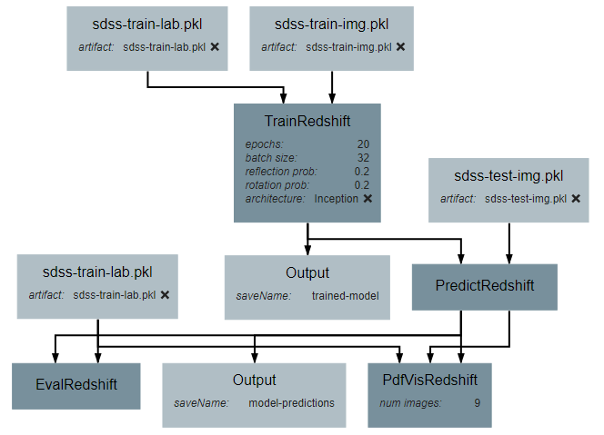

Input Operations
================

While it is possible to retrieve the data needed for model creation programmatically in many cases, this guide makes use of the **Input** operations to load preprocessed data. This is in the interest of both simplicity and generalizability to datasets and data sources different than those used in this tutorial.

This pipeline uses four **Input** operations. These operations provide the training input images, training output values, testing input images, and testing output values. For the purposes of this tutorial, the structure of the input images is a 4D numpy array of shape (N, 64, 64, 5), where N is the number of images. The outputs are 1D numpy arrays of length N. The process described in this tutorial will work for images that are not 64*64 pixels in size and that use any number of color channels, requiring only a slight change in the neural network.

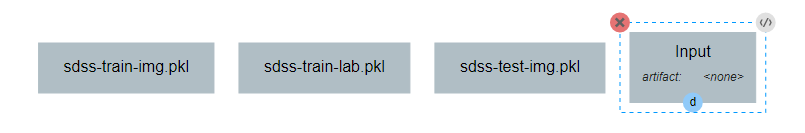

Each **Input** operation requires an artifact to have been added to the project. To do this, go to the artifacts view and click either of the two floating buttons in the bottom right of the workspace (one button only appears on hover).

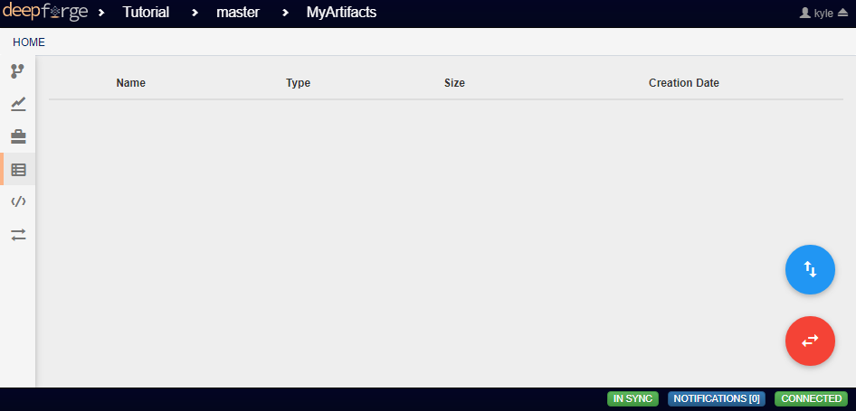

With these buttons, you can either upload a local file to one of the storage backends or import a file that already exists within a storage backend.

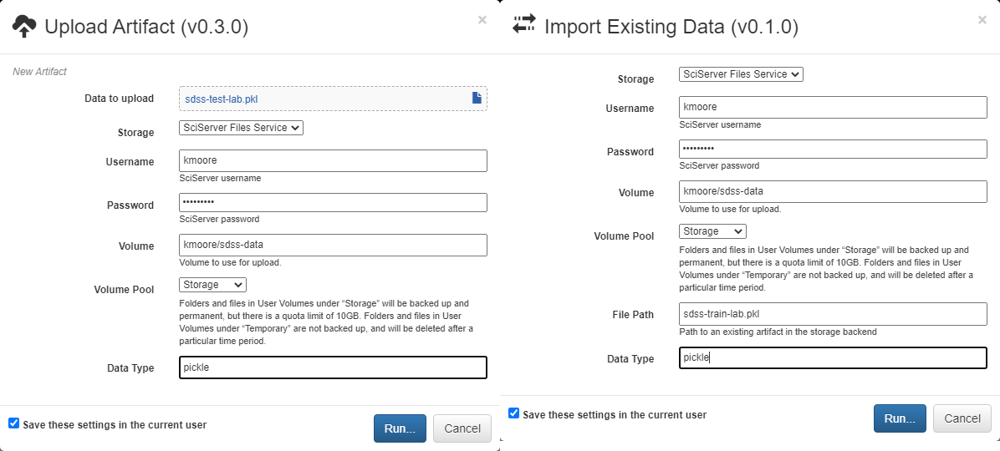

By default, all artifacts are treated as python `pickle objects <https://docs.python.org/3/library/pickle.html>`_. Using other forms of serialized data, such as `FITS <https://fits.gsfc.nasa.gov/fits_documentation.html>`_ or `npy <https://numpy.org/doc/stable/reference/generated/numpy.lib.format.html>`_ files, requires defining a custom serializer in the *Custom Serialization* view, which is not covered in this tutorial.

TrainRedshift Operation
=======================

The first custom operation will create and train the neural network classifier.

Two attributes should be added: *batch_size* and *epochs*. Batch size is the number of training samples that the model will be trained on at a time and epochs is the number of times that each training sample will be given to the model. Both are important hyperparameters for training a neural network. For this guide, the attributes are defined as shown below, but the exact number used for default values can be changed as desired by the reader.

This operation will require two inputs (images and labels) and a neural network architecture. Finally, the operation produces one output, which is the trained classifier model. After all inputs, outputs, and attributes have been added, the structure of the operation should appear similar to the following:

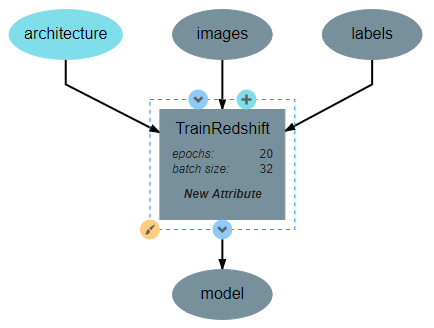

The code for this operation follows the standard procedure for creating and training a Keras network with one minor caveat. The method used by Pasquet et al. on which this pipeline is based formulates redshift prediction as a classification problem. Because the labels used in this tutorial are floating point values, they must be converted into a categorical format. This is the purpose of the *to_categorical* function. The code for this operation is shown below.

.. code-block:: python

    import numpy as np

    class TrainRedshift():
        def __init__(self, architecture,
                        epochs=20,
                        batch_size=32):
            self.arch = architecture
            self.epochs = epochs
            self.batch_size = batch_size
            
            # Maximum expected redshift value and number of bins to be used in classification
            # step. The max_val will need to change to be reasonably close to the maximum
            # redshift of your dataset. The number of bins must match the output shape of the
            # architecture but may be tuned as a hyperparameter. Both can optionally be made
            # attributes of the operation.
            self.max_val = 0.4
            self.num_bins = 180
            return

        def execute(self, images, labels):
            print(type(labels))
            print("Initializing Model")

            # Initialize the model
            self.arch.compile(loss='sparse_categorical_crossentropy',
                            optimizer='adam',
                            metrics=['sparse_categorical_accuracy'])
            print("Model Initialized Successfully")
            
            print("Beginning Training")
            print("Training images shape:", images.shape)
            print("Training labels shape:", labels.shape)

            # Train the model on the images and the labels. Labels are converted to categorical
            # data because the architecture expects an index to an output vector of length 180
            self.arch.fit(images,
                          self.to_categorical(labels),
                          epochs=self.epochs,
                          verbose=2)

            print("Training Complete")

            # Saves the model in a new variable. This is necessary so that the
            # ouput of the operation is named 'model'
            model = self.arch
            return model

        # Converts floating point labels to categorical vectors. The result for a given input
        # label is a 1D vector of length 1 whose value is the index representing the range in
        # which the label falls. For example, if the max_val is 0.4 and the num_bins is 4, the
        # possible indices are 0-3, representing the ranges [0,0.1), [0.1,0.2), [0.2,0.3), and
        # [0.3,0.4] respectively. So, a label of 0.12 results in an output of [1]
        def to_categorical(self, labels):
            return np.array(labels) // (self.max_val / self.num_bins)

After the operation is fully defined, it needs to be added to the workspace and connected to the **Input** operations as shown below. Specifically, the training images and training outputs should be connected to the *images* and *labels* inputs of **TrainRedshift** respectively.

Note that the architecture selected from within the pipeline editor until after the `Neural Network Architecture`_ section of this guide is completed.

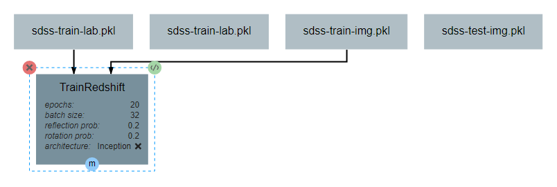

Neural Network Architecture
===========================
This section will describe how to create a convolutional neural network for estimating redshift from images. In particular, this section gives instructions on creating an `Inception-v1 network <https://towardsdatascience.com/a-simple-guide-to-the-versions-of-the-inception-network-7fc52b863202#8fff>`_. The basic structure of this network is an input block, a series of five inception blocks, followed by a densely connected classifier block. These blocks are each described in order below.

For reference during design, the full architecture can be found `here <images/incep-full.png>`_.

Input Block
^^^^^^^^^^^
The input block begins, as with all network architectures, with an **Input** layer. The shape of this layer should be the shape of the input images (64\*64\*3 in this case). This input feeds into a 5\*5 **Conv2D** layer with 64 filters and linear activation. The activation here is linear because the layer is to be activated by the **PReLU** layer that follows. The Input block is finished with an **AveragePooling2D** layer with a window size and stride of 2. Note that all layers use *same* padding to prevent changes in data shape due to the window size.

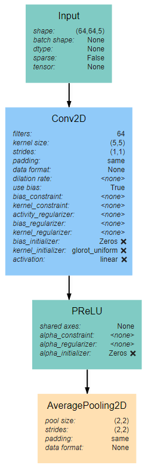

Inception Blocks
^^^^^^^^^^^^^^^^
The five inception blocks fall into one of three designs. Blocks 1 and 3 share the same design, as do blocks 2 and 4. Each of the three designs are described more detail below. Take note throughout these subsections that every **Conv2D** layer is followed by a **PReLU** layer using the default attribute values. In addition, all **AveragePooling2D** layers will use have the attribute values of (2,2) for both *pool_size* and *strides* and *same* for *padding*. In the interest of brevity, this will not be pointed out in each subsection.

Inception Blocks 1 and 3
~~~~~~~~~~~~~~~~~~~~~~~~
Blocks 1 and 3 each begins with an **AveragePooling2D** layer. This is the same layer pictured at the bottom of the input block and blocks 2 and 4. The output of this layer is fed into 4 separate **Conv2D** layers that all have a *kernel_size* of 1\*1. Two of these new layers feed into another **Conv2D** layer, one with *kernel_size* 3\*3 and another with *kernel_size* 5\*5. Another of the original **Conv2D** layers feeds into an **AveragePooling2D** layer. Finally, the remaining original **Conv2D** layer, along with the **AveragePooling2D** layer and the two new **Conv2D** layers all feed into a **Concatenate** layer. For reference, the expected structure is shown below.

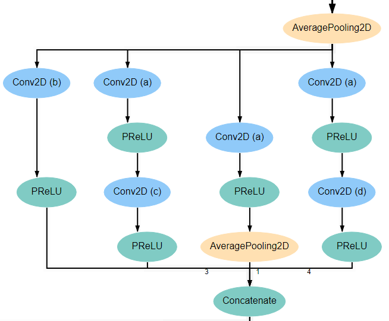

Inception Blocks 2 and 4
~~~~~~~~~~~~~~~~~~~~~~~~
Blocks 2 and 4 are laid out mostly identically to blocks 1 and 3, with the exception of the first and last layers. The first layer in these blocks is the **Concatenate** layer from the end of the previous block. In addition, another **AveragePooling2D** layer is added after the **Concatenate** layer at the end of the block. For reference, the expected structure is shown below.

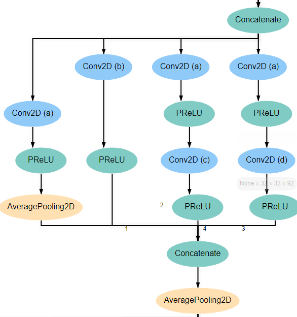

Inception Block 5
~~~~~~~~~~~~~~~~~
Block 5 is laid out mostly identically to blocks 1 and 3. The only difference is that one of the two branches with two **Conv2D** layers is omitted. Specifically, the branch in which the second layer has a *kernel_size* of 5\*5 is left out. For reference, the expected structure is shown below.

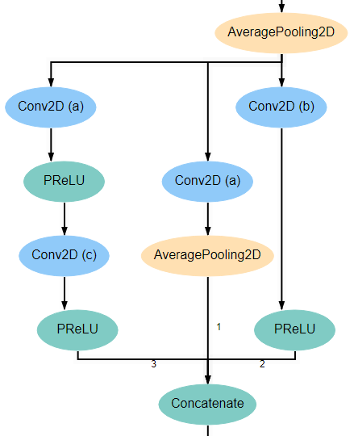

Conv2D Attributes
~~~~~~~~~~~~~~~~~
All **Conv2D** layers in the architecture use a stride of 1, use *same* padding, and use a *linear* activation function. The only attributes that vary between the various layers are the number of *filters* and the *kernel_size*. Notice in the diagrams above that every **Conv2D** layer is marked with an identifying letter. The table below gives the correct values for *filters* and *kernel_size* for every layer in each inception block.

+-----------+---------------+---------------+---------------+---------------+---------------+
|           | Block 1       | Block 2       | Block 3       | Block 4       | Block 5       |
+-----------+-------+-------+-------+-------+-------+-------+-------+-------+-------+-------+
|Con2D layer|filters|kernel |filters|kernel |filters|kernel |filters|kernel |filters|kernel |
+-----------+-------+-------+-------+-------+-------+-------+-------+-------+-------+-------+
|    a      |   48  | (1,1) |   64  | (1,1) |   92  | (1,1) |   92  | (1,1) |   92  | (1,1) |
+-----------+-------+-------+-------+-------+-------+-------+-------+-------+-------+-------+
|    b      |       | (1,1) |       | (1,1) |       | (1,1) |       | (1,1) |       | (1,1) |
+-----------+       +-------+       +-------+       +-------+       +-------+  128  +-------+
|    c      |   64  | (3,3) |   92  | (3,3) |  128  | (3,3) |  128  | (3,3) |       | (3,3) |
+-----------+       +-------+       +-------+       +-------+       +-------+-------+-------+
|    d      |       | (5,5) |       | (5,5) |       | (5,5) |       | (5,5) |               |
+-----------+-------+-------+-------+-------+-------+-------+-------+-------+---------------+

Classifier Block
^^^^^^^^^^^^^^^^

The classifier block begins with a **Flatten** layer to reshape the data into a 1D vector. This feeds into a **Dense** layer with 1096 units and ReLU activation. The next layer is a **Dropout** layer intended to help prevent overfitting. The dropout rate used here is 0.3, but this may require tuning to fit the dataset most appropriately. . Finally, a **Dense** layer using softmax activation produces the final output. This final layer must use the value for *units* as the *num_bins* variable used in various operations. An optional **Output** layer may also be included but is unnecessary as long as the **Dense** layer is the lowest layer in the architecture.

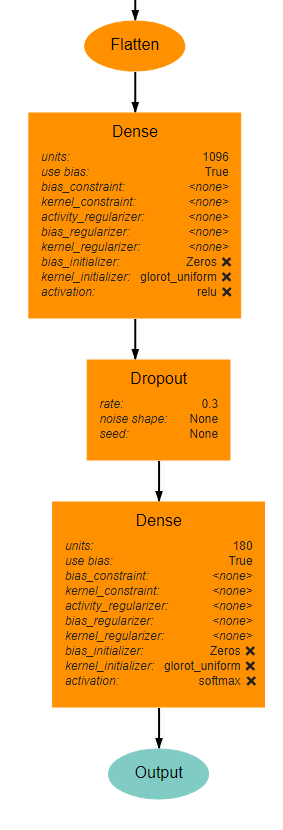

PredictRedshift Operation
=========================
This operation uses the model created by **TrainRedshift** to predict the values of a set on input images. This operation has no attributes, takes a model and a set of images as input and produces a set of predicted values (named *labels*) and the associates probability density functions that resulted in those values (named *pdfs*). The structure of the operation is as shown below:

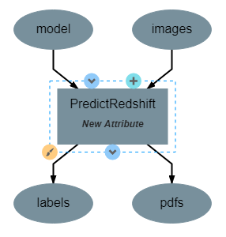
   
The *model.predict* function results in a probability density function (PDF) over all redshift values in the allowed range [0,0.4]. In order to get scalar values for predictions, a weighted average is taken for each PDF where the value being averaged is the redshift value represented by that bin and the weight is the PDF value at that bin (i.e. how likely it is that the value represented by that bin is the actual redshift value).

.. code-block:: python

    import numpy as np

    class PredictRedshift():

        def execute(self, images, model):
            # See first comment in PredictRedshift()
            max_val = 0.4
            num_bins = 180
            step = max_val / num_bins
            
            # Generates PDF for the redshift of each image
            pdfs = model.predict(images)
            bin_starts = np.arange(0, max_val, step)
            
            # Regresses prediction to a scalar value. Essentially a weighted average
            # where the weights are the pdf values for each bin and the values are
            # the beginning of the range represented by each bin.
            labels = np.sum((bin_starts + (step / 2)) * pdfs, axis=1)
            
            return pdfs, labels

After the operation is fully defined, it needs to be added to the workspace and connected to the previous operations as shown below. Specifically, the *test images* **Input** operation and the *model* output from **TrainRedshift** should be connected to the *images* and *model* inputs to **PredictRedshift** respectively.

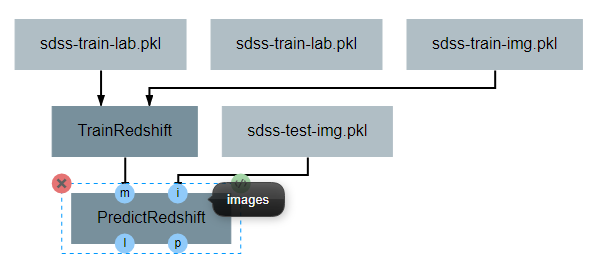

EvalRedshift Operation
======================
This operation creates a figure for evaluating the accuracy of the redshift model. The resulting figure (shown on the right in the image below) plots the true redshift value against the predicted value. The further a point falls away from the diagonal dotted line, the more incorrect that prediction.

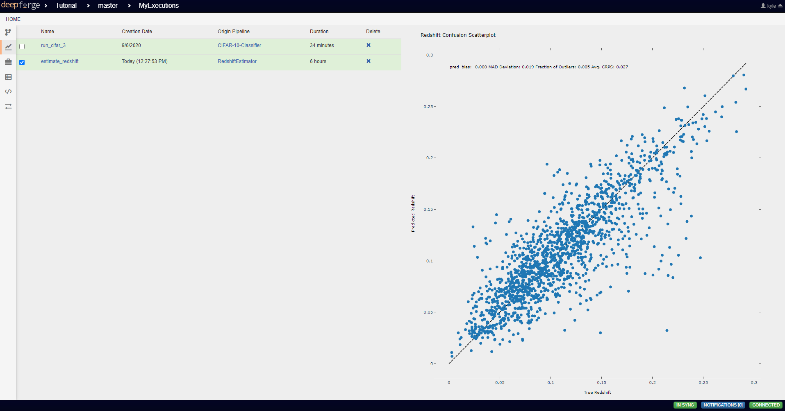

This operation has no attributes and produces no output. It requires two inputs in the form of a list of predicted redshift values (*pt*) and a list of actual redshift values (*gt*). The structure of the operation is as shown below:

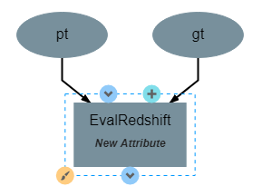

The code for this operation is below and is heavily annotated to explain the various graphing functions.

.. code-block:: python

    import numpy as np
    from properscoring import crps_gaussian
    import matplotlib.pyplot as plt

    class EvalRedshift():

        def execute(self, gt, pt):
            print('Evaluating model')
            
            # Calculates various metrics for later display. For more info, see section 4.1 of
            # of Pasquet et. al.
            residuals = (pt - gt) / (gt + 1)
            pred_bias = np.average(residuals)
            dev_MAD = np.median(np.abs(residuals - np.median(residuals))) * 1.4826
            frac_outliers = np.count_nonzero(np.abs(residuals) > (dev_MAD * 5)) / len(residuals)
            crps = np.average(crps_gaussian(pt, np.mean(pt), np.std(pt)))

            # Creates the figure and gives it a title
            plt.figure()
            plt.title('Redshift Confusion Scatterplot')

            # Plots all galaxies where the x-value is the true redshift of a galaxy and the
            # y-value is the predicted redshift value of a galaxy
            plt.scatter(gt, pt)
            
            # Creates a dashed black line representing the line on which a perfect prediction
            # would lie. This line has a slope of 1 and goes from the origin to the maximum 
            # redshift (predicted or actual)
            maxRS = max(max(gt), max(pt))
            endpoints = [0, maxRS]
            plt.plot(endpoints, endpoints, '--k')

            # Creates a formatted string with one metric per line. Prints metrics to three
            # decimal places
            metricStr = 'pred_bias: {pb:.03f}\n' + \
                        'MAD Deviation: {dm:.03f}\n' + \
                        'Fraction of Outliers: {fo:.03f}\n' + \
                        'Avg. CRPS: {ac:.03f}'
            formattedMetrics = metricStr.format(pb=pred_bias,
                                                dm=dev_MAD,
                                                fo=frac_outliers,
                                                ac=crps)
            
            # Prints the metrics string at the top left of the figure
            plt.text(0, maxRS, formattedMetrics, va='top')
            
            # Labels axes and displays figure
            plt.ylabel('Predicted Redshift')
            plt.xlabel('True Redshift')
            plt.show()
            
            return    

Notice in the above code that there is a new library used to calculate one of the metrics. This library is not standard and is not included in many default environments. Because of this, the library needs to be added to the environment at runtime by going to the *Environment* tab in the operation editor and defining the operation dependencies as shown below. Operation dependencies are defined in the style of a `conda environment file <https://conda.io/projects/conda/en/latest/user-guide/tasks/manage-environments.html#creating-an-environment-file-manually>`_.

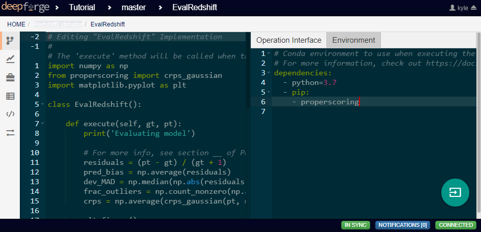

After the operation is fully defined, it needs to be added to the workspace and connected to the previous operations as shown below. Specifically, the test values **Input** operation and the *labels* output from **PredictRedshift** should be connected to the *gt* and *pt* inputs to **EvalRedshift** respectively.

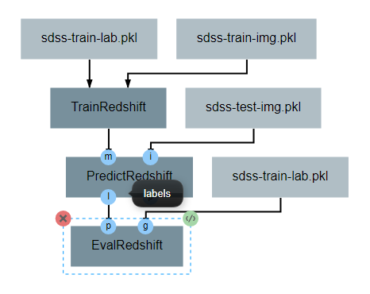

PdfVisRedshift Operation
========================
This operation creates another figure for evaluating the accuracy of the redshift model as shown below. Compared to the output of the **EvalRedshift** operation, this figure provides a more zoomed in picture of individual predictions. Each of the subplots is a plotting of the probability density function for a randomly chosen input image. The red and green lines indicate the predicted and actual value of the image's redshift value respectively.

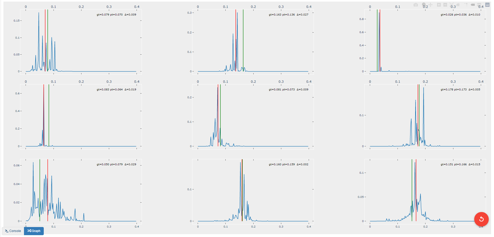

This operation has one attribute, *num_images* and produces no output. It requires three inputs in the form of a list of predicted redshift values (*pt*), a list of actual redshift values (*gt*), and a list of probability density functions (*pdfs*). The structure of the operation is as shown below:

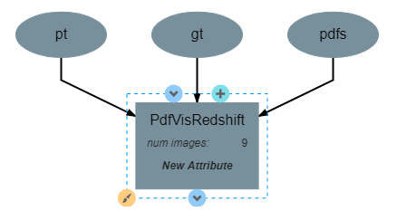

The code for this operation is below and is heavily annotated to explain the various graphing functions.

.. code-block:: python

    import numpy as np
    import matplotlib.pyplot as plt
    import math

    class PdfVisRedshift():
        def __init__(self, num_images=9):

            # Calculates the number of rows and columns needed to arrange the images in
            # as square of a shape as possible
            self.num_images = num_images
            self.num_cols = math.ceil(math.sqrt(num_images))
            self.num_rows = math.ceil(num_images / self.num_cols)

            self.max_val = 0.4
            return

        def execute(self, gt, pt, pdfs):

            # Creates a collection of subfigures. Because each prediciton uses the same bins, 
            # x-axes are shared.
            fig, splts = plt.subplots(self.num_rows,
                                      self.num_cols,
                                      sharex=True,
                                      sharey=False)
            
            # Chooses a random selection of indices representing the chosen images
            random_indices = np.random.choice(np.arange(len(pt)),
                                              self.num_images,
                                              replace=False)
            
            # Extracts the pdfs and redshifts represented by the chosen indices
            s_pdfs = np.take(pdfs, random_indices, axis=0)
            s_pt = np.take(pt, random_indices, axis=0)
            s_gt = np.take(gt, random_indices, axis=0)
            
            # Creates a list of the lower end of the ranges represented by each bin
            x_range = np.arange(0, self.max_val, self.max_val / pdfs.shape[1])
            
            for i in range(self.num_images):
                col = i % self.num_cols
                row = i // self.num_cols

                # Creates a line graph from the current image's pdf
                splts[row,col].plot(x_range, s_pdfs[i],'-')

                # Creates two vertical lines to represent the predicted value (red) and the
                # actual value (green)
                splts[row,col].axvline(s_pt[i], color='red')
                splts[row,col].axvline(s_gt[i], color='green')
                
                # Creates a formatted string with one metric per line. Prints metrics to three
                # decimal places. d (delta) is how far off the prediction was from the actual value
                metricString = 'gt={gt:.03f}\npt={pt:.03f}\n \u0394={d:.03f}'
                metricString = metricString.format(gt = s_gt[i],
                                                   pt = s_pt[i],
                                                   d  = abs(s_gt[i]-s_pt[i]))
                
                # Determines whether the metrics should be printed on the left or right of the
                # figure. If prediction is on the left end, the right side should be more clear
                # and should be the chosen side.
                alignRight = s_pt[i] <= self.max_val / 2
                
                # Adds the metric string to the figure at the top of the subfigure (which is the
                # max value of that pdf)
                splts[row,col].text(self.max_val if alignRight else 0,
                                    np.max(s_pdfs[i]),
                                    metricString,
                                    va='top',
                                    ha='right' if alignRight else 'left')
            
            # Automatically tweaks margins and positioning of the graph
            plt.tight_layout()
            plt.show()

After the operation is fully defined, it needs to be added to the workspace and connected to the previous operations as shown below. Specifically, the *labels* and *pdfs* output from **PredictRedshift** and the test values **Input** operation should be connected to the *pt*, *pdfs* and *pt* inputs to **PdfVisRedshift** respectively.

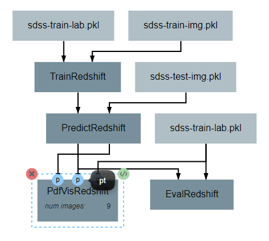

Output Operations
=================
**Output** operations are special operations that allow saving python objects generated during execution. For instance, in this tutorial, it might be useful to save the trained model and the generated predictions for later use or analysis. Shown below is the result of adding two **Output** operations to the pipeline to save these two objects.

Objects created in this way will be saved in the execution working directory (defined in *Execution Options* when executing a pipeline) under the name given to the operation's *saveName* attribute. Objects saved in this manner will also be automatically added to the list of available artifacts for use in other pipelines.

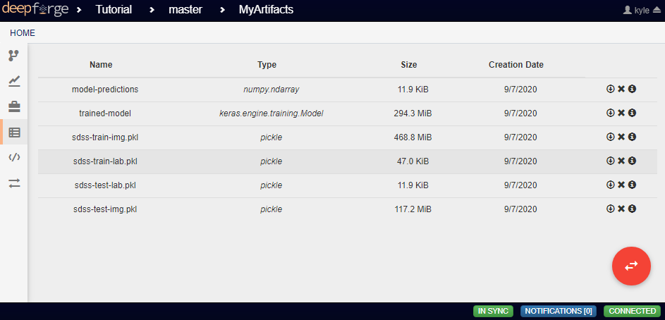

Execution and Results
=====================
As with all pipelines, this pipeline can be executed using the red floating button in the bottom right of the pipeline editor view. In addition to the normal settings that are always included, this pipeline (as with any pipeline using **Input** operations) required additional credentials for each artifact being used.

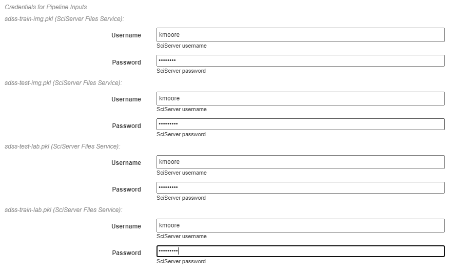

To view the output of the execution, go to the *Executions* tab and check the box next to the desired execution.

For a more detailed and larger view of individual figures, click on the name of the execution to view its status page and open the console output for the desired operation. In the bottom left is a set of buttons for switching between console output and graph output for that operation.

