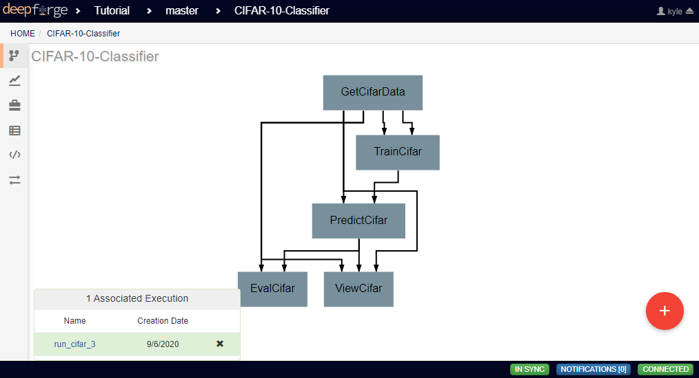
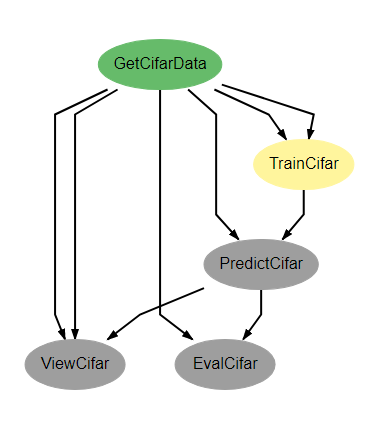
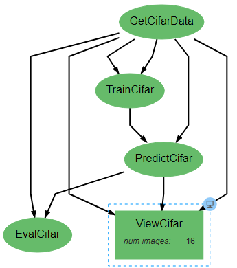
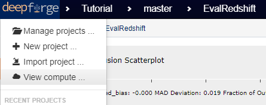
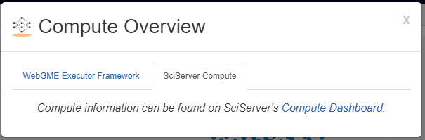
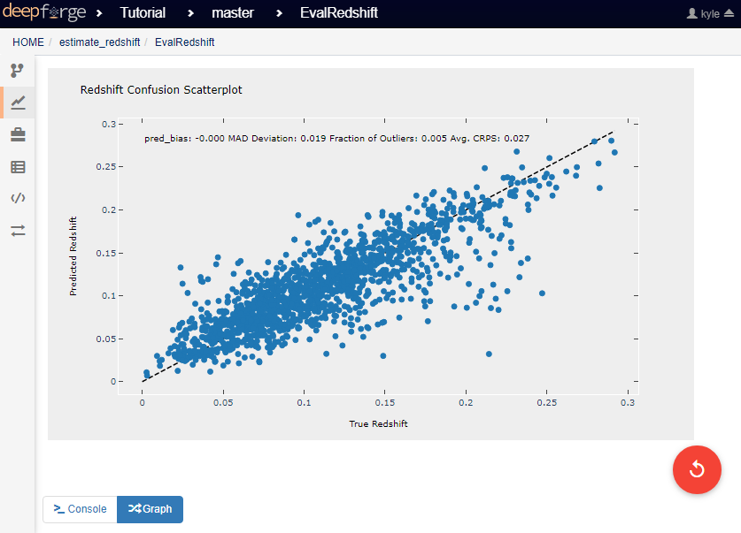

Viewing Executions
------------------

This page will guide you through monitoring the execution of pipelines and viewing the output of finished executions.

Monitoring Executions
~~~~~~~~~~~~~~~~~~~~~
After execution has been started through DeepForge, the status of an execution can be checked using numerous methods.

Viewing Execution Status
^^^^^^^^^^^^^^^^^^^^^^^^

While in the workspace for a pipeline, the bottom left corner shows a list of all executions associated with the pipeline. Clicking on the name of an execution will open the status tracker for that execution.

An alternative method of getting to this screen is to go to the *Executions* tab for a list of all executions for the current project. In this view, clicking the name of the desired execution will also open the status tracker.

.. figure:: images/cifar-select-execution.png
    :align: center
    :scale: 50%

In the status tracker view, the current status for the execution is displayed on an operation level. Each operation is colored based upon its status, with the following possible states:

* Gray - Awaiting Execution
* Yellow - Currently Executing
* Green - Execution Finished Successfully
* Orange - Execution Cancelled
* Red - Error Encountered During Execution

Also in this view, clicking on an operation will reveal the attribute values used for this execution. Clicking the blue monitor icon in the top right of a selected operation will open the console output for that operation.

Viewing the Compute Dashboard
^^^^^^^^^^^^^^^^^^^^^^^^^^^^^
In the top left of the webpage, clicking the DeepForge logo will open the DeepForge main dropdown menu. In this menu is an option named *View Compute*.

This option opens a dialog box that displays the current execution status of the connected compute backends. Each backend will have its own tab with information specific to that backend. The SciServer Compute tab includes a direct link to SciServer's Compute Dashboard, where the status and output of current and past executions can be viewed.

Viewing Execution Output
~~~~~~~~~~~~~~~~~~~~~~~~
Execution output can be viewed in one of two major ways. Textual output that is printed to the console can be viewed by going to the `execution status tracker <Viewing Execution Status>`_, selecting the operation that produces the desired output, and clicking on the blue monitor icon in the top right of the operation. For operations generating matplotlib figures, a set of buttons in the bottom left will allow swapping between console and matplotlib figures.

Graphical output, which will generally by generated using a graphical library like `Matplotlib <https://matplotlib.org/>`_, can be viewed from the *Executions* tab on the sidebar. Beside each execution is a checkbox. Activating a checkbox will display the graphical output generated during that execution. Selecting multiple boxes will display the output from all selected executions together.

.. figure:: images/cifar-select-execution.png
    :align: center
    :scale: 50%
